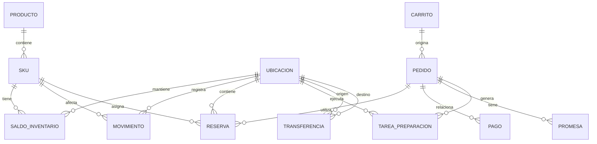

# Stock Único — NovaRetail

**Fuente:** entrevistas del caso `NovaRetail: Stock Único`  
**Método:** PROMPT ATLAS v2.0  
**Regla:** contenido sustentado exclusivamente en las entrevistas; los vacíos se mantienen como pendientes.

## Entidades de dominio identificadas

- Producto
- SKU
- Ubicación
- Saldo de inventario
- Movimiento
- Reserva
- Carrito
- Pedido
- Pago
- Promesa
- Tarea de preparación
- Transferencia

## Relaciones derivadas directamente de las entrevistas

- SKU ↔ ubicación ↔ saldo de inventario.
- Movimiento afecta el inventario.
- Reserva asigna unidades a una intención/pedido y ubicación.
- Pedido se relaciona con pago, reserva, promesa y preparación.
- Tarea de preparación se ejecuta en una ubicación.
- Transferencia relaciona ubicación origen/destino.

## Estados explícitamente mencionados

### Inventario
físico, disponible, reservado, comprometido, bloqueado, dañado, en tránsito, pendiente de recepción.

### Reserva
creada, confirmada, liberada, vencida y trasladada aparecen como estados/operaciones mencionados; las transiciones exactas están pendientes.

### Pedido/preparación
confirmado, preparación iniciada, listo y entregado aparecen en eventos/flujo; el catálogo completo de estados no está definido.

## Modelo conceptual Mermaid

**Nota:** las cardinalidades son una representación estructural preliminar y requieren validación; las entrevistas no definen un modelo cardinal completo.
