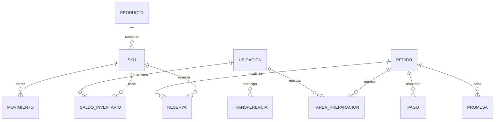
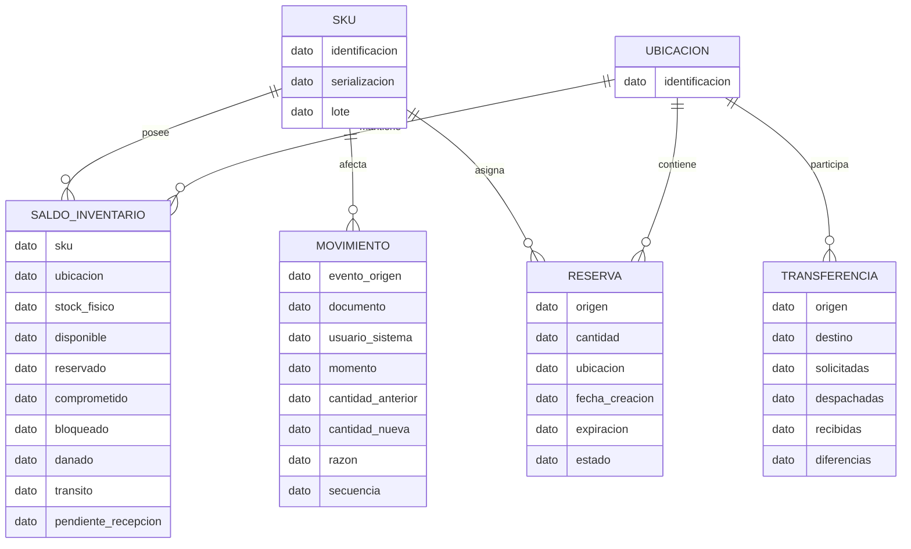
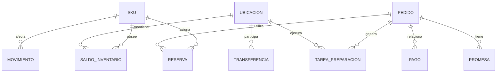

# Stock Único — NovaRetail

**Fuente:** entrevistas del caso `NovaRetail: Stock Único`  
**Método:** PROMPT ATLAS v2.0  
**Regla:** contenido sustentado exclusivamente en las entrevistas; los vacíos se mantienen como pendientes.

# Modelo conceptual

Entidades: Producto, SKU, Ubicación, Saldo de inventario, Movimiento, Reserva, Carrito, Pedido, Pago, Promesa, Tarea de preparación y Transferencia.

# Modelo lógico

## Atributos conocidos

**SALDO_INVENTARIO:** SKU, ubicación, stock físico, disponible, reservado, comprometido, bloqueado, dañado, tránsito, pendiente de recepción.

**MOVIMIENTO:** evento de origen, documento relacionado, usuario/sistema, momento, cantidad anterior, cantidad nueva, razón, secuencia.

**RESERVA:** origen, cantidad, ubicación, creación, expiración, estado.

**TRANSFERENCIA:** origen, destino, solicitadas, despachadas, recibidas, diferencias.

**TAREA_PREPARACION:** cola/prioridad, ubicación interna cuando exista, tiempo objetivo, SKU/cantidad, faltante/daño, estado listo.

**PEDIDO/PAGO/PROMESA/CARRITO:** son objetos identificados, pero sus atributos completos no están definidos.

# Modelo físico

**Estado: PENDIENTE DE DEFINICIÓN.**

Las entrevistas no proporcionan motor de BD, tablas físicas, tipos, PK/FK, índices, particionamiento ni estrategia de persistencia. Por tanto, no se inventa un modelo físico implementable.

Los objetos que eventualmente deberán persistirse son los objetos de negocio identificados, sujetos a diseño posterior.

El diagrama físico es solo un inventario de objetos candidatos, no un esquema técnico aprobado.
