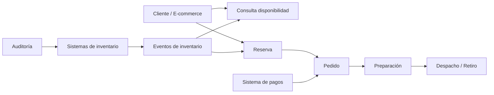

# Stock Único — NovaRetail

**Fuente:** entrevistas del caso `NovaRetail: Stock Único`  
**Método:** PROMPT ATLAS v2.0  
**Regla:** contenido sustentado exclusivamente en las entrevistas; los vacíos se mantienen como pendientes.

# Evidencia arquitectónica confirmada

Las entrevistas exigen una arquitectura que:

1. permita conocer qué dato es autoridad para cada operación;
2. procese eventos de inventario casi en tiempo real;
3. continúe vendiendo de manera segura ante retrasos de integraciones;
4. no reemplace todos los sistemas actuales en una sola etapa;
5. soporte baja latencia para ventas/reservas;
6. aplique mayor consistencia a la confirmación de reserva que a consultas generales;
7. mantenga auditoría e idempotencia/concurrencia.

## Capacidades arquitectónicas identificadas

| Capacidad | Estado |
|---|---|
| Consolidación de disponibilidad | Confirmada |
| Gestión transaccional de reservas | Confirmada |
| Procesamiento de eventos de inventario | Confirmada |
| Integración con sistemas existentes | Confirmada |
| Fulfillment desde tienda/CD | Confirmada |
| Operación degradada | Confirmada como necesidad |
| Auditoría de inventario | Confirmada |
| Analítica histórica | Necesidad identificada |
| IA recomendadora | Potencial |

## Decisiones arquitectónicas que NO están tomadas

- arquitectura de microservicios vs monolito;
- base de datos;
- mensajería;
- cache;
- API gateway;
- cloud/on-premise;
- estrategia de consistencia concreta;
- patrón de transacción distribuida;
- mecanismo de compensación;
- particionamiento;
- observabilidad;
- despliegue.

No se presentan como decisiones.

## Vista de capacidades

La arquitectura tecnológica concreta queda pendiente de las decisiones indicadas en `15_discrepancias.md`.
