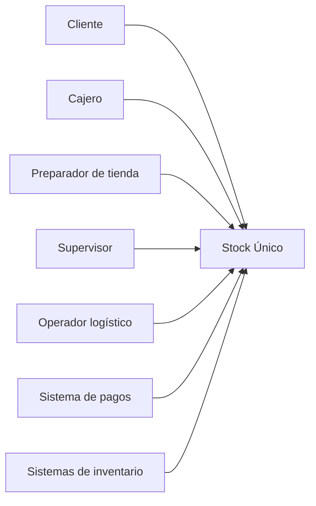

# Especificación SDD — Casos de Uso
## Stock Único — NovaRetail

## Actores identificados en las entrevistas

- Cliente
- Cajero
- Preparador de tienda
- Supervisor
- Operador logístico
- Sistema de pagos
- Sistemas de inventario

**Fuente:** líneas 160–165.

## CU-01 — Consultar disponibilidad y promesa

**Actor principal:** Cliente  
**Actores/sistemas relacionados:** Sistemas de inventario.

**Flujo:**
1. El cliente consulta producto/cantidad.
2. El sistema determina una ubicación candidata.
3. Considera modalidad de entrega.
4. Determina disponibilidad y promesa.
5. Informa vigencia de la oferta.
6. Si existe información degradada, aplica el comportamiento correspondiente.

**Alternativas pendientes:** la fórmula exacta de disponibilidad y reglas de degradación no están definidas.

---

## CU-02 — Crear reserva

**Actor principal:** Cliente / Checkout.

**Flujo:**
1. El cliente inicia o confirma el pago.
2. El sistema valida disponibilidad.
3. Crea una reserva temporal.
4. Registra origen, cantidad, ubicación, creación, expiración y estado.
5. Controla concurrencia e idempotencia.
6. La reserva puede confirmarse, liberarse, vencer o trasladarse.

**Pendiente:** duración y reglas exactas de transición.

---

## CU-03 — Procesar pago, pedido y reserva

**Actores:** Cliente, sistema de pagos, sistema de pedidos/reservas.

**Flujo:**
1. Se registra el intento.
2. Se procesa el pago.
3. Se correlaciona el resultado con pedido y reserva.
4. Si el pago es aprobado, debe existir pedido.
5. La reserva confirmada conserva trazabilidad.

**Pendiente:** mecanismo de compensación ante fallos distribuidos.

---

## CU-04 — Asignar ubicación

**Actor:** Sistema de fulfillment.

Debe considerar:
- disponibilidad;
- distancia;
- capacidad;
- horario;
- costo;
- prioridad de tienda;
- fecha prometida;
- restricciones de producto.

**Fuente:** líneas 93–95.

**Pendiente:** pesos, algoritmo y reglas de desempate.

---

## CU-05 — Preparar pedido

**Actor:** Preparador de tienda.

**Flujo:**
1. Recibe tarea.
2. Consulta cola priorizada.
3. Ubica producto cuando exista información de ubicación interna.
4. Escanea SKU.
5. Valida SKU y cantidad.
6. Embala.
7. Marca listo para despacho o recojo.
8. Reporta faltante/daño si corresponde.

---

## CU-06 — Gestionar faltante

**Actor:** Preparador / operación de tienda.

**Flujo:**
1. El preparador no encuentra una unidad.
2. Registra excepción.
3. El sistema busca otra ubicación.
4. Recalcula la promesa.
5. Se ofrecen alternativas al cliente.

Alternativas mencionadas:
- nueva fecha;
- cambio de tienda;
- producto sustituto;
- devolución.

---

## CU-07 — Gestionar retiro en tienda

**Actor:** Cliente / preparador.

**Flujo:**
1. Cliente selecciona tienda.
2. Sistema verifica disponibilidad.
3. Se genera promesa.
4. Pedido se prepara.
5. Cuando está listo, se genera código de recojo.
6. Se valida quién retira.
7. Se registra entrega.
8. Si no se recoge dentro del plazo, se libera la reserva.

**Pendiente:** plazo de recojo.

---

## CU-08 — Registrar movimiento de inventario

**Actores:** Cajero, sistemas de inventario, operador correspondiente.

Movimientos identificados:
- venta;
- recepción;
- transferencia;
- devolución;
- anulación;
- conteo;
- ajuste;
- daño;
- robo.

El sistema registra el movimiento y conserva trazabilidad/auditoría.

---

## CU-09 — Registrar conteo y ajuste

**Actor:** Supervisor / usuario autorizado.

**Flujo:**
1. Se detecta diferencia.
2. Se realiza conteo.
3. Se registra ajuste autorizado.
4. Se conserva motivo, usuario y evidencia.
5. El cambio queda auditado.

**Pendiente:** roles exactos de autorización.

---

## CU-10 — Gestionar transferencia

**Actor:** Operador de inventarios/logística.

**Flujo:**
1. Se registra origen y destino.
2. Se registran unidades solicitadas.
3. Se registran unidades despachadas.
4. Se registra tránsito.
5. Se registran unidades recibidas.
6. Se registran diferencias.
7. El stock en tránsito no se considera disponible hasta recepción.

---

## CU-11 — Operar en modo degradado

**Actor:** Cliente / sistema.

**Condición:** integración o fuente retrasada.

El sistema debe continuar vendiendo de manera segura sin mostrar información engañosa.

**Pendiente:** definición operacional del modo degradado.

---

## CU-12 — Consultar indicadores

**Actores:** CEO, responsables de negocio/operación.

Indicadores identificados:
- cancelación por falta de stock;
- exactitud;
- promesa cumplida;
- ventas omnicanal;
- rotación;
- quiebres;
- costo de preparación;
- reservas vencidas;
- conversión;
- abandono;
- productos sin disponibilidad;
- tiempo de preparación;
- reasignaciones;
- sustituciones;
- origen de problemas.

---

## Diagrama de contexto de casos de uso

## Trazabilidad

Los actores y objetos de negocio utilizados en estos casos de uso aparecen en las evidencias iniciales de las entrevistas: líneas 162–164.
