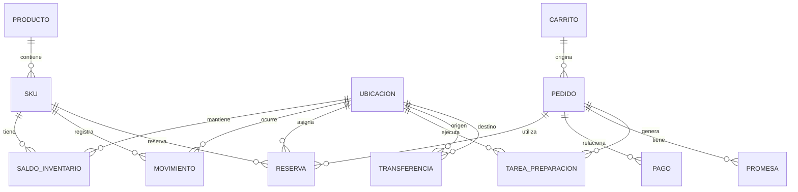
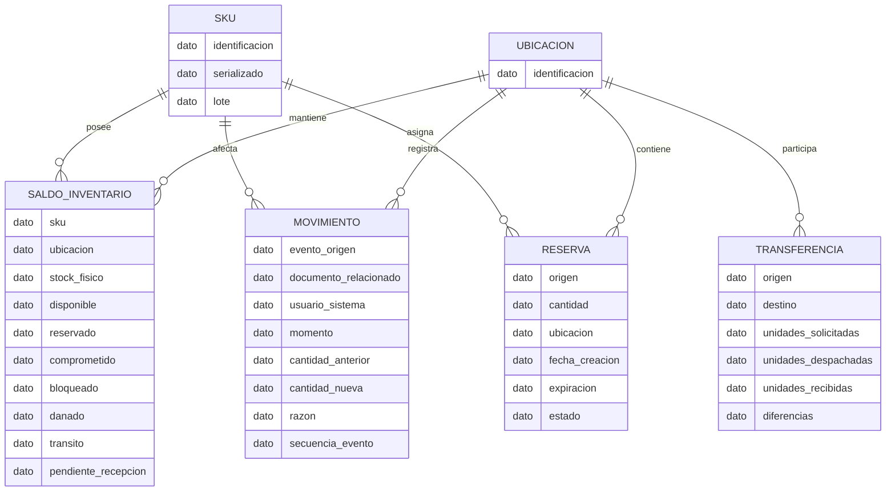
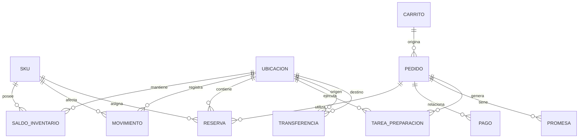

# Especificación SDD — Modelos de Datos
## Stock Único — NovaRetail

> **Regla de modelado:** únicamente se utilizan objetos y atributos explícitamente mencionados en las entrevistas. Los nombres de entidades son una representación estructural de esos objetos; no constituyen una decisión tecnológica.

## 1. Modelo conceptual

### Entidades conceptuales identificadas

- Producto
- SKU
- Ubicación
- Inventario / saldo de inventario
- Movimiento
- Reserva
- Carrito
- Pedido
- Pago
- Promesa
- Tarea de preparación
- Transferencia

**Fuente:** líneas 162–163.

### Relaciones conceptuales derivadas de las entrevistas

- Un SKU tiene inventario asociado a una ubicación.
- Los movimientos afectan el inventario.
- Una reserva asigna unidades a una intención de compra o pedido y una ubicación.
- Un pedido se relaciona con reserva, pago, promesa y tarea de preparación.
- Una tarea se ejecuta en una ubicación.
- Una transferencia relaciona ubicación origen y destino.

Estas relaciones se derivan de las descripciones operativas de líneas 71–107 y 120–146.

### Mermaid — ER conceptual

> El modelo conceptual no define cardinalidades de negocio que las entrevistas no hayan establecido de manera inequívoca; las relaciones anteriores representan las dependencias operativas expresadas en el material y deben validarse.

---

# 2. Modelo lógico

## Entidades y atributos explícitamente disponibles

### SKU
- identificación de SKU
- condición de serialización cuando corresponda
- manejo por lote cuando corresponda

### Saldo de inventario
- SKU
- ubicación
- stock físico
- disponible
- reservado
- comprometido
- bloqueado
- dañado
- en tránsito
- pendiente de recepción

### Movimiento
- origen/evento
- documento relacionado
- usuario o sistema
- momento
- cantidad anterior
- cantidad nueva
- razón
- secuencia de evento

### Reserva
- origen
- cantidad
- ubicación
- fecha de creación
- expiración
- estado

### Transferencia
- origen
- destino
- unidades solicitadas
- unidades despachadas
- unidades recibidas
- diferencias

### Pedido
La entrevista identifica el objeto pedido y su relación con pago, reserva, preparación y promesa, pero no define su estructura completa.

### Pago
La entrevista identifica intento de pago, pago aprobado y correlación con pedido/reserva, pero no define atributos completos.

### Promesa
La entrevista menciona modalidad, fecha prometida y cambio de promesa, pero no define una estructura completa.

### Tarea de preparación
Se conocen: ubicación, prioridad/cola, tiempo objetivo, SKU/cantidad, faltante/daño y estado listo.

## Mermaid — ER lógico

**Advertencia:** `dato` se utiliza deliberadamente como tipo neutro porque las entrevistas no especifican tipos de datos físicos.

---

# 3. Modelo físico preliminar

La entrevista **no proporciona**:
- motor de base de datos;
- tablas existentes;
- nombres de columnas;
- tipos de datos;
- claves primarias;
- claves foráneas;
- índices;
- particionamiento;
- estrategia de almacenamiento;
- retención;
- tecnología de persistencia.

Por tanto, no es válido inventar un modelo físico implementable.

Se entrega únicamente una **estructura física candidata derivada de los objetos de negocio**, pendiente de decisión arquitectónica.

### Candidatos de persistencia

| Objeto entrevistado | Representación física candidata | Estado |
|---|---|---|
| SKU | SKU | Pendiente de diseño físico |
| Ubicación | UBICACION | Pendiente |
| Saldo de inventario | SALDO_INVENTARIO | Pendiente |
| Movimiento | MOVIMIENTO | Pendiente |
| Reserva | RESERVA | Pendiente |
| Carrito | CARRITO | Pendiente |
| Pedido | PEDIDO | Pendiente |
| Pago | PAGO | Pendiente |
| Promesa | PROMESA | Pendiente |
| Tarea de preparación | TAREA_PREPARACION | Pendiente |
| Transferencia | TRANSFERENCIA | Pendiente |

### Mermaid — ER físico preliminar

El siguiente diagrama **no define tipos, PK, FK ni índices**; solo representa los objetos de persistencia que deberán validarse.

## Decisiones de diseño explícitamente pendientes

Las entrevistas piden que la especificación haga explícitas las decisiones sobre:

1. consistencia fuerte frente a eventual;
2. consulta de disponibilidad frente a confirmación de reserva;
3. inventario agregado frente a unidades serializadas;
4. transacciones distribuidas entre reserva, pago y pedido;
5. expiración y compensación de reservas;
6. operación normal frente a modo degradado;
7. datos operativos en tiempo real frente a analítica histórica.

**Fuente:** líneas 168–178.
