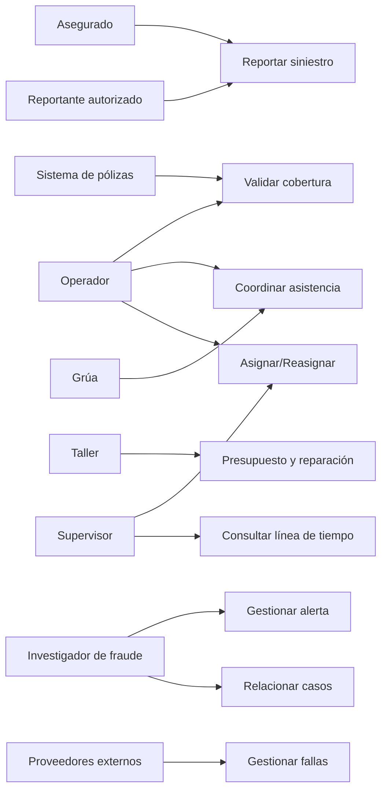

# Siniestro Fácil — Casos de Uso

## 1. Actores

- Asegurado.
- Reportante autorizado.
- Operador.
- Ajustador.
- Investigador de fraude.
- Supervisor.
- Taller.
- Proveedor de grúa.
- Sistema de pólizas.
- Proveedores de mapas, mensajería y medios de pago.
- Proveedores/servicios de integración mencionados por el CEO.

**Origen:** EV-01, CEO-09.

## 2. Casos de uso

### CU-01 — Reportar siniestro
**Actores:** Asegurado, Reportante autorizado.  
**Origen:** CEO-03, CEO-06.

**Flujo principal**
1. El reportante inicia el reporte.
2. Se registra la información mínima disponible.
3. Se crea el caso.
4. Se solicita/recopila evidencia cuando corresponda.
5. El sistema informa el siguiente paso.

**Excepciones**
- El titular no puede reportar: participa un reportante autorizado.
- El cliente está en situación de riesgo: no se exige toda la evidencia al inicio.

**Pendiente:** acreditación del autorizado.

---

### CU-02 — Validar siniestro y cobertura
**Actores:** Operador, sistema de pólizas.  
**Origen:** OPS-01, CEO-09.

1. Se confirma identidad.
2. Se verifica póliza.
3. Se verifica vehículo.
4. Se verifica cobertura.
5. Se verifica deducible.
6. El caso continúa según resultado.

**Pendiente:** reglas de validación y tratamiento de resultados.

---

### CU-03 — Recopilar y preservar evidencia
**Actores:** Asegurado, operador, investigador.  
**Origen:** OPS-03, FRA-03.

1. Se recibe evidencia.
2. Se vincula al siniestro.
3. Se registra fecha/momento.
4. Se conservan metadatos disponibles.
5. Se preserva el original.
6. Se registran transformaciones y derivados.

---

### CU-04 — Coordinar asistencia
**Actores:** Operador, proveedor de grúa.  
**Origen:** CEO-03, OPS-01, OPS-09.

1. Se determina si corresponde asistencia.
2. Se solicita al proveedor.
3. Se registra respuesta.
4. Si no responde, se reintenta, escala o reasigna.

---

### CU-05 — Asignar y reasignar siniestro
**Actores:** Supervisor, operador, ajustador.  
**Origen:** OPS-05.

1. Se consideran ciudad, daño, severidad, cobertura, disponibilidad y riesgo.
2. Se dirige a flujo digital o ajustador.
3. Si procede reasignación, se conserva historial y motivo.

**Pendiente:** algoritmo/criterios de asignación.

---

### CU-06 — Gestionar inspección y evaluación
**Actores:** Operador, ajustador.  
**Origen:** OPS-04, OPS-08.

1. El caso pasa a evaluación.
2. Puede programarse inspección.
3. Se recibe información de evaluación.
4. El caso continúa según el estado correspondiente.

**Pendiente:** detalle del procedimiento de inspección.

---

### CU-07 — Gestionar reparación y presupuesto
**Actores:** Taller, operador/supervisor.  
**Origen:** OPS-07.

1. El taller recibe la orden.
2. Presenta presupuesto y diagnóstico.
3. Puede recibir observaciones.
4. Puede presentar repuestos alternativos o ampliaciones.
5. Se registra aprobación.
6. Se conserva vigencia del presupuesto.

**Pendiente:** reglas y niveles de aprobación.

---

### CU-08 — Gestionar alerta antifraude
**Actores:** Investigador de fraude.  
**Origen:** FRA-02, FRA-04, FRA-05.

1. Se genera una alerta.
2. Se registra tipo y severidad.
3. Se registra explicación y datos de origen.
4. Se identifica regla/modelo y fecha.
5. El investigador confirma, descarta o solicita información.
6. Se registra justificación.
7. Según política, el caso puede continuar, priorizarse o detener temporalmente un pago.

**Pendiente:** umbrales y política concreta.

---

### CU-09 — Relacionar casos
**Actor:** Investigador de fraude.  
**Origen:** FRA-08.

1. Se detectan elementos compartidos.
2. Se relacionan expedientes.
3. Se mantiene cada expediente separado.

---

### CU-10 — Consultar línea de tiempo
**Actores:** Operador, supervisor, investigador.  
**Origen:** OPS-10.

La línea de tiempo debe permitir reconstruir:
- registros;
- cambios;
- evidencias;
- cobertura;
- proveedores;
- presupuestos;
- comunicaciones;
- pagos autorizados.

---

### CU-11 — Consultar avance
**Actor:** Asegurado.  
**Origen:** CEO-03, CEO-06.

1. El asegurado consulta el caso.
2. Visualiza avance.
3. Visualiza siguiente paso.

---

### CU-12 — Gestionar fallas de integración
**Actores:** Operador, sistema, proveedor externo.  
**Origen:** CEO-09, OPS-09.

1. Se envía solicitud.
2. Se registra aceptada, rechazada o sin respuesta.
3. Ante falta de respuesta se reintenta, escala o reasigna.
4. El caso no queda bloqueado por un único proveedor.

---

### CU-13 — Gestionar acceso sensible
**Actores:** Operador, investigador.  
**Origen:** CEO-07, FRA-07.

1. Se valida rol/necesidad.
2. Se concede o deniega acceso según autorización existente.
3. Las consultas y descargas sensibles quedan registradas.

**Pendiente:** matriz de roles/permisos.

## 3. Relaciones generales

