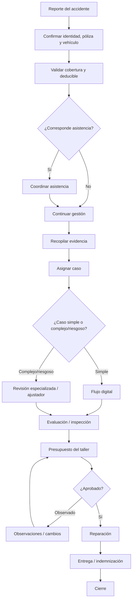
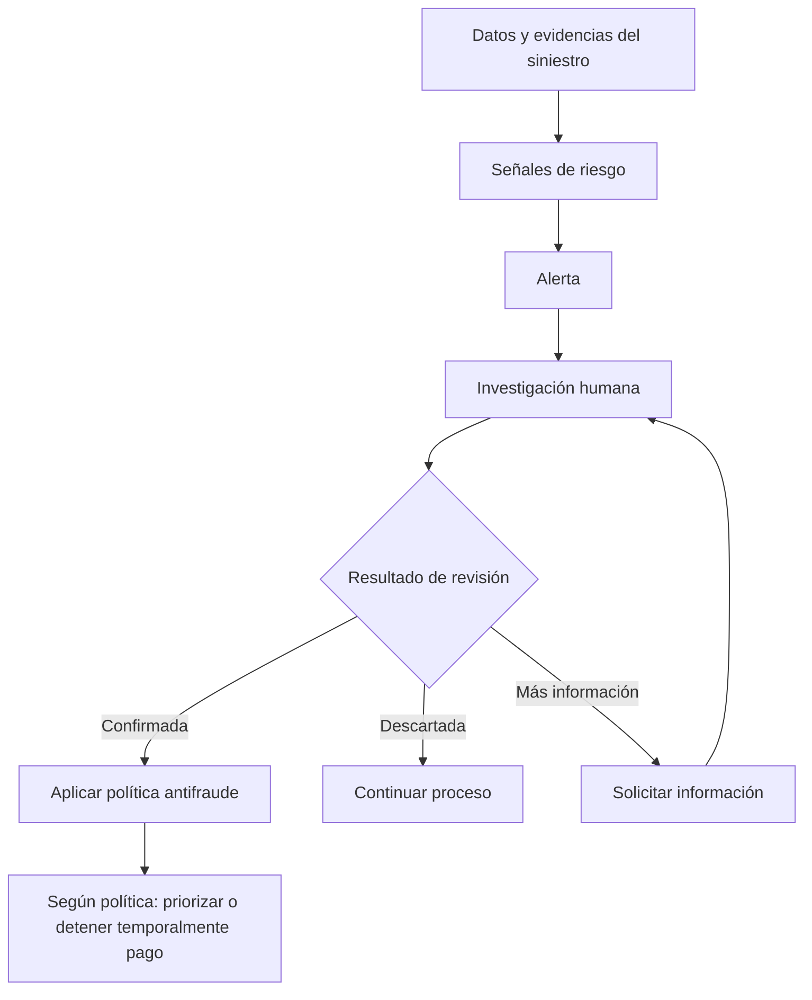
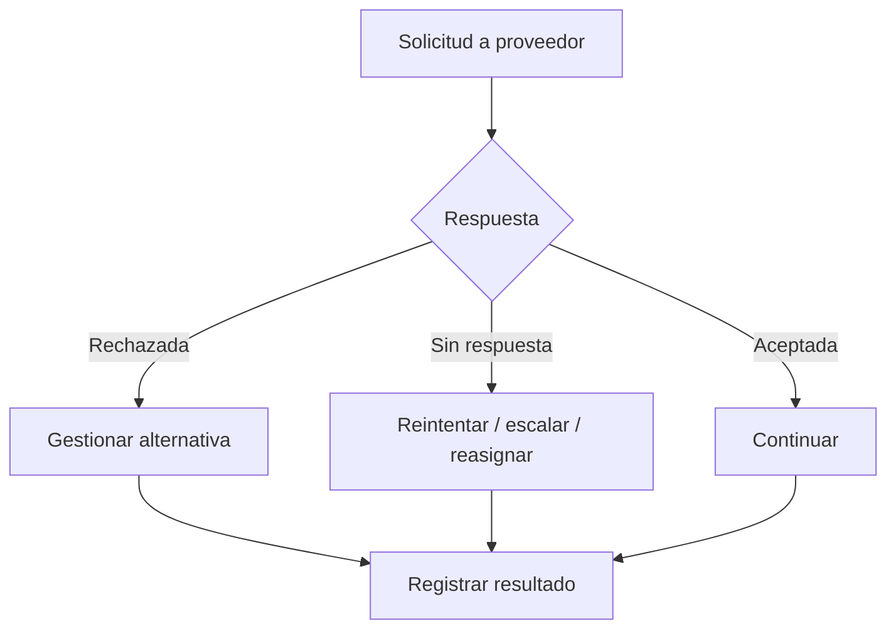
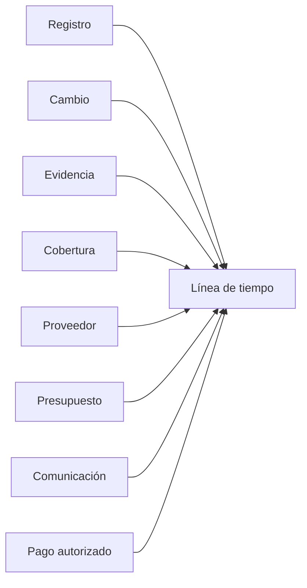

# Siniestro Fácil — Mapa de Procesos

## 1. Alcance

El mapa representa únicamente el flujo que puede reconstruirse a partir de las entrevistas.

## 2. Proceso de alto nivel

**Origen:** OPS-01, OPS-04, OPS-05, OPS-07; CEO-03, CEO-05.

## 3. Proceso antifraude transversal

**Origen:** FRA-02, FRA-04, FRA-05.

## 4. Proceso de proveedores

**Origen:** OPS-09.

## 5. Proceso de auditoría

**Origen:** OPS-10.

## 6. Procesos que no pueden detallarse aún

- Reglas de transición de estados.
- Procedimiento completo de inspección.
- Política exacta de cobertura/deducible.
- Política de deduplicación.
- SLA exactos.
- Política de aprobación de presupuestos.
- Política antifraude cuantificada.
- Retención de evidencias.
