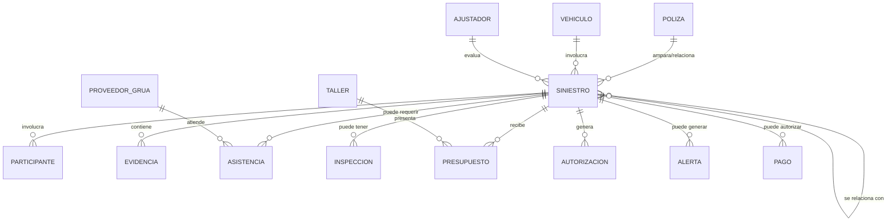
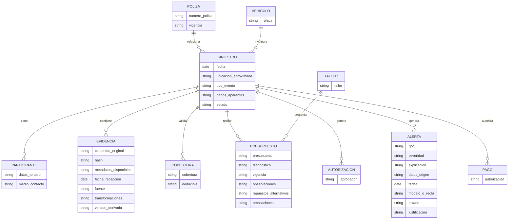
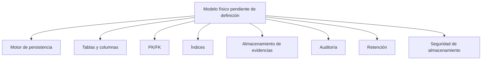
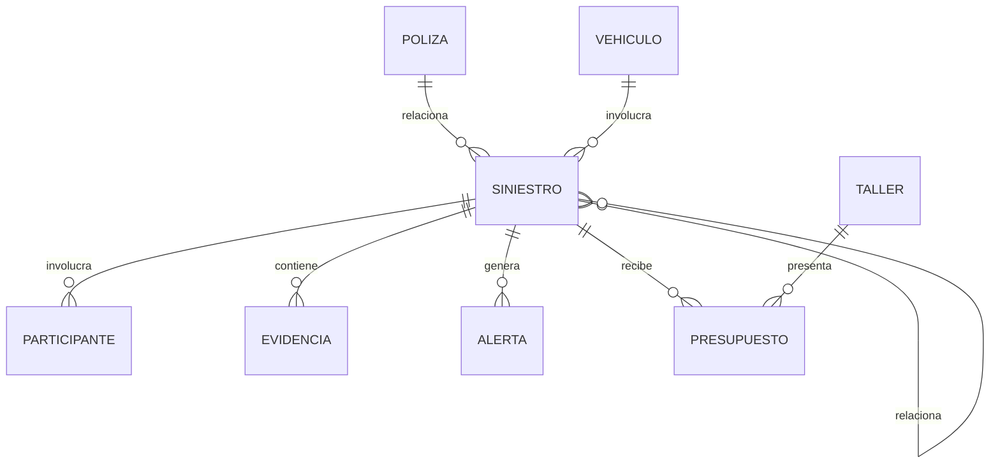
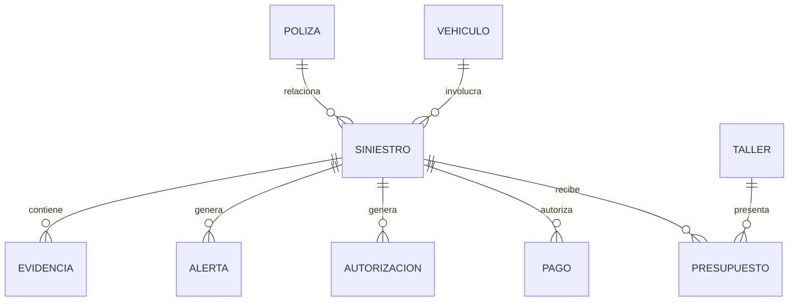

# Siniestro Fácil — Modelos de Datos

## 1. Regla de modelado

Los modelos se limitan a objetos y relaciones expresamente mencionados. No se inventan atributos, cardinalidades exactas ni claves técnicas que las entrevistas no definan.

## 2. Modelo conceptual

### Entidades identificadas

- Póliza
- Vehículo
- Siniestro
- Participante
- Cobertura
- Evidencia
- Asistencia
- Inspección
- Presupuesto
- Autorización
- Alerta
- Pago
- Taller
- Proveedor de grúa
- Ajustador
- Persona/actor de operación
- Caso relacionado

### Relaciones conceptuales

**Origen:** EV-02, EV-03, EV-04; OPS-01..10; FRA-01..10.

## 3. Modelo lógico

El modelo lógico puede especificar las entidades, pero las entrevistas no proporcionan atributos completos ni claves. Por tanto, los atributos siguientes se limitan a conceptos explícitos:

| Entidad | Datos explícitamente mencionados |
|---|---|
| Póliza | número de póliza, vigencia |
| Vehículo | placa |
| Siniestro | fecha, ubicación aproximada, tipo de evento, daños aparentes, estados |
| Participante | persona, teléfono/contacto, datos de terceros |
| Cobertura | cobertura, deducible |
| Evidencia | contenido original, hash, metadatos, fecha de recepción, fuente, transformaciones, versiones |
| Asistencia | tipo de asistencia implícito por coordinación de grúa; detalle no definido |
| Inspección | programación; detalle no definido |
| Presupuesto | presupuesto, diagnóstico, vigencia, observaciones, repuestos alternativos, ampliaciones |
| Autorización | quién aprobó, autorización de reparación |
| Alerta | tipo, severidad, explicación, datos de origen, fecha, modelo/regla, estado, justificación |
| Pago | pago autorizado |
| Taller | taller, disponibilidad/referencia operativa |
| Proveedor de grúa | proveedor, respuesta de solicitud |
| Ajustador | asignación/participación |
| Relación de casos | elementos compartidos entre casos |

### Diagrama lógico

**Importante:** los nombres de campos anteriores son una representación lógica de conceptos expresamente mencionados, no un diseño físico aprobado.

## 4. Modelo físico

### Estado

**NO DEFINIBLE COMPLETAMENTE con el material de entrevistas.**

Las entrevistas no especifican:
- motor de base de datos;
- tablas definitivas;
- nombres físicos;
- tipos de datos;
- claves primarias/foráneas;
- índices;
- particionamiento;
- estrategia de almacenamiento de imágenes;
- esquema de auditoría;
- retención;
- cifrado;
- volúmenes;
- alta disponibilidad.

Por lo tanto, un modelo físico completo sería inventar información.

### Inventario físico pendiente

## 5. Diagrama entidad-relación por nivel

### ER conceptual

### ER lógico

### ER físico

**Pendiente de definición.** No se crea un ER físico con columnas o claves inventadas porque las entrevistas no las proporcionan.

## 6. Discrepancias de datos

1. No existe política exacta de deduplicación aunque Operaciones reporta casos duplicados.
2. No se define la cardinalidad exacta entre póliza, vehículo, siniestro y participantes.
3. No se define la retención de imágenes originales.
4. No se define la infraestructura para almacenar originales y derivados.
5. No se define el esquema de auditoría.
6. No se define cómo se modelan múltiples reclamos del mismo accidente.
7. No se define la identificación técnica de personas, talleres, proveedores o dispositivos.
