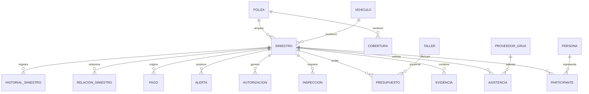

# Siniestro Fácil — Modelo conceptual

> Estado: PROPUESTA INICIAL. No representa todavía un modelo de datos aprobado.

## 1. Criterio

El modelo conceptual se deriva de los objetos de negocio explícitamente identificados en las entrevistas: póliza, vehículo, siniestro, participante, cobertura, evidencia, asistencia, inspección, presupuesto, autorización, alerta y pago. fileciteturn19file12L1-L1

## 2. Entidades/conceptos candidatos

| Concepto | Razón de existencia | Estado |
|---|---|---|
| Póliza | Permite validar la relación contractual del caso | Confirmado como objeto |
| Vehículo | Se identifica por placa y participa en el siniestro | Confirmado como objeto |
| Siniestro | Expediente central del evento | Confirmado como objeto |
| Participante | Permite representar personas y otros involucrados | Confirmado como objeto |
| Cobertura | Se valida junto con el siniestro | Confirmado como objeto |
| Evidencia | Fotografías, documentos, declaración y otros soportes | Confirmado como objeto |
| Asistencia | Coordinación de ayuda/grúa | Confirmado como objeto |
| Inspección | Evaluación del vehículo/caso | Confirmado como objeto |
| Presupuesto | Propuesta económica del taller | Confirmado como objeto |
| Autorización | Decisión sobre reparación/cambios | Confirmado como objeto |
| Alerta | Señal de riesgo/fraude revisable | Confirmado como objeto |
| Pago | Resultado económico del proceso | Confirmado como objeto |
| Persona/Reportante | Identidad y autorización de quien reporta | Candidato de modelado |
| Taller | Proveedor que presenta presupuesto y diagnóstico | Candidato de modelado |
| Proveedor de grúa | Proveedor de asistencia | Candidato de modelado |
| Ajustador | Actor especializado en casos complejos | Candidato de modelado |
| Evento/Historial | Necesario para línea de tiempo y trazabilidad | Candidato de modelado |
| Relación entre casos | Permite relacionar sin fusionar expedientes | Candidato de modelado |

## 3. Relaciones conceptuales propuestas

## 4. Puntos a validar

1. Si una póliza puede tener múltiples vehículos dentro del alcance del producto.
2. Si cobertura pertenece conceptualmente a póliza, versión de póliza o ambos.
3. Si participante debe ser una entidad independiente de Persona.
4. Si un siniestro puede tener múltiples presupuestos simultáneamente.
5. Si una autorización puede existir para cada versión de presupuesto.
6. Si pago puede ser indemnización, pago a taller u otra modalidad.
7. Si asistencia puede tener múltiples intentos/proveedores.
8. Cómo se modelará la relación entre siniestros relacionados.
9. Qué nivel de historial necesita el negocio: estado, campo modificado, actor, motivo y/o evento de integración.
10. Qué elementos de la entidad Alerta son obligatorios para reproducibilidad.

## 5. Regla de modelado

No se fija todavía un motor de base de datos ni tipos físicos. La entrevista exige conservar original, hash, metadatos, fuente y transformaciones de evidencia, y mantener reproducibilidad de alertas mediante versiones, datos de entrada y revisión humana. fileciteturn19file1L1-L1
