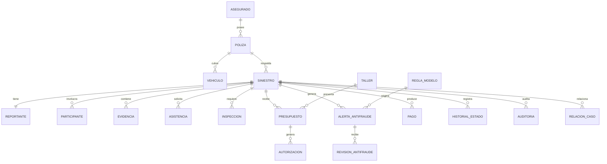

# Siniestro Fácil — Modelo conceptual

## Fuente
Derivado de los objetos de negocio y procesos mencionados en las entrevistas. fileciteturn19file1

## Regla de modelado
Las entidades siguientes son **candidatas conceptuales**, no una afirmación de que el sistema existente las implemente con esas estructuras.

## Entidades candidatas
- **Asegurado:** persona que mantiene la relación aseguradora y puede reportar.
- **Reportante:** persona que efectúa el reporte; puede ser el asegurado o una persona autorizada.
- **Póliza:** contrato de seguro que debe validarse para el siniestro.
- **Vehículo:** vehículo relacionado con la póliza/siniestro.
- **Siniestro:** expediente principal del evento reportado.
- **Participante:** persona/entidad involucrada en un siniestro; permite representar terceros y múltiples relaciones.
- **Cobertura:** cobertura aplicable a una póliza y utilizada en la evaluación.
- **Evidencia:** fotografía, documento, declaración u otro soporte vinculado al siniestro.
- **Asistencia:** solicitud/coordinación con proveedor de asistencia o grúa.
- **Inspección:** evaluación programada/ejecutada del daño.
- **Taller:** proveedor que recibe orden y presenta presupuesto.
- **Presupuesto:** propuesta económica del taller, con diagnóstico y cambios.
- **Autorización:** decisión sobre presupuesto/cambio/reparación.
- **Alerta antifraude:** señal generada por regla o modelo.
- **Revisión antifraude:** tratamiento humano de una alerta.
- **Pago/indemnización:** resultado económico autorizado.
- **Historial de estado:** evolución del siniestro.
- **Auditoría:** registro de quién hizo qué, cuándo y qué cambió.
- **Relación entre casos:** vínculo entre expedientes potencialmente relacionados sin fusionarlos.
- **Regla/modelo antifraude:** versión utilizada para producir una alerta.

## Relaciones conceptuales

## Relaciones que requieren validación
1. Cardinalidad exacta entre póliza y vehículo.
2. Si un siniestro puede tener más de una póliza asociada.
3. Definición de participante y tipos permitidos.
4. Si asistencia e inspección son opcionales en todos los escenarios.
5. Si un presupuesto puede pertenecer a más de un taller.
6. Si una autorización corresponde siempre a un presupuesto o también a otras decisiones.
7. Relación exacta entre pago e indemnización.
8. Política para relacionar siniestros sin fusionarlos.
9. Qué entidades requieren historial/versionado además de reglas/modelos antifraude.

## Criterio de salida
El modelo conceptual pasa a lógico cuando las entidades, relaciones y cardinalidades críticas estén validadas por negocio y las preguntas relevantes estén resueltas.
