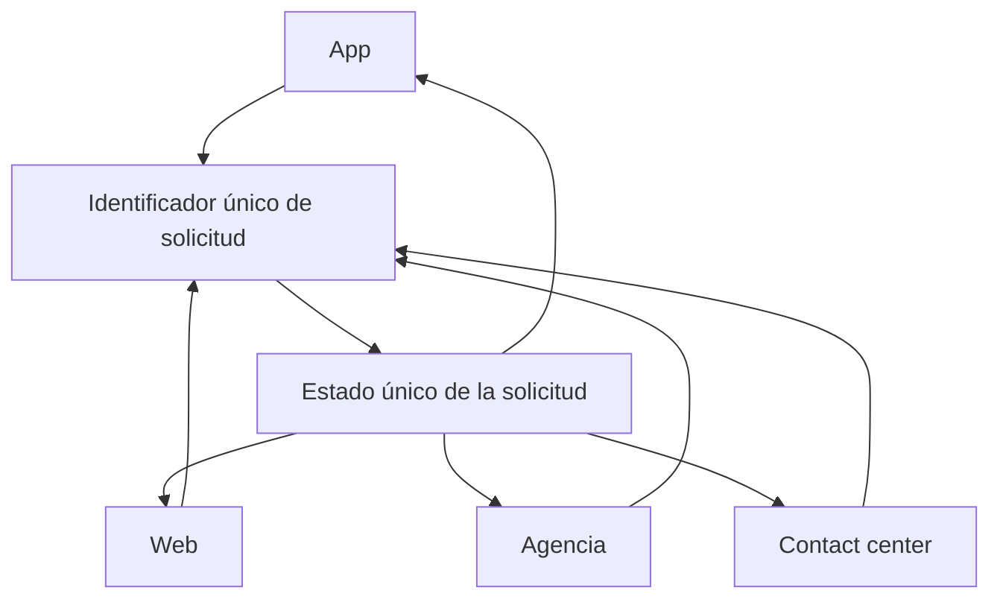
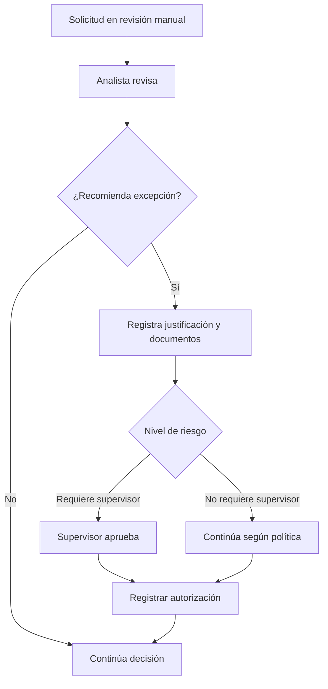

# Crédito Ágil 360 — Mapa de Procesos

## Proceso de negocio derivado

```mermaid
flowchart LR
    A[Oferta / Simulación] --> B[Iniciar solicitud]
    B --> C[Confirmar datos]
    C --> D[Autorizar consultas]
    D --> E[Completar información]
    E --> F[Adjuntar documentos cuando corresponda]
    F --> G[Validar identidad]
    G --> H[Consultar información]
    H --> I[Aplicar políticas de elegibilidad]
    I --> J{Resultado}
    J -->|Aprobado| K[Revisar condiciones]
    J -->|Rechazado| R[No aprobado]
    J -->|Observado| L[Solicitar información / acción]
    J -->|Revisión manual| M[Revisión de analista]
    M --> N{Excepción]
    N -->|No| I
    N -->|Sí| O[Recomendación de excepción]
    O --> P[Aprobación supervisor según nivel]
    P --> I
    K --> Q[Aceptar contrato]
    Q --> S[Listo para desembolso]
    S --> T[Desembolso]
    T --> U[Confirmación]
```

> Nota: el flujo refleja los pasos explícitamente mencionados. No se agregan actividades operativas no descritas.

## Continuidad omnicanal



## Gestión de excepciones



## Estados visibles al cliente

```mermaid
stateDiagram-v2
    [*] --> Borrador
    Borrador --> "Información pendiente"
    "Información pendiente" --> "En evaluación"
    "En evaluación" --> "Requiere documento"
    "En evaluación" --> "Requiere validación"
    "En evaluación" --> Aprobado
    "En evaluación" --> "No aprobado"
    Aprobado --> "Pendiente de aceptación"
    "Pendiente de aceptación" --> "Listo para desembolso"
    "Listo para desembolso" --> Desembolsado
    Borrador --> Cancelado
    "Información pendiente" --> Cancelado
    "En evaluación" --> Cancelado
```

## Procesos asíncronos o síncronos

Las entrevistas sí permiten identificar situaciones de integración que pueden fallar, necesidad de reprocesamiento y notificaciones, pero **no definen formalmente** qué operaciones deben ser síncronas o asíncronas. Por tanto, no se asigna una arquitectura de ejecución como requisito cerrado.

**Pendiente:** clasificación síncrono/asíncrono por integración y etapa, SLA y mecanismo de reintento.
