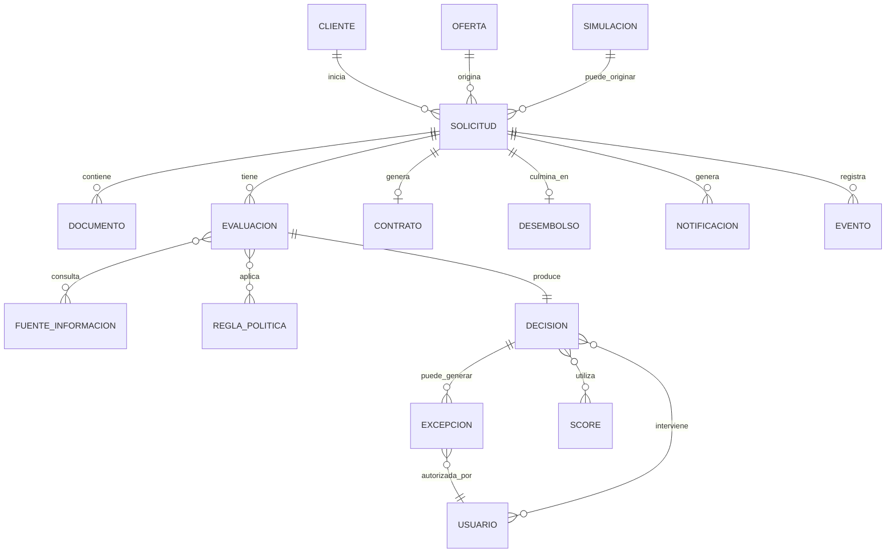

# Crédito Ágil 360 — Modelo Conceptual

## Criterio

El modelo conceptual representa objetos de negocio explícitamente mencionados en las entrevistas. No pretende fijar tablas, claves ni atributos físicos.

## Entidades / objetos conceptuales

- Cliente
- Oferta
- Simulación
- Solicitud
- Documento
- Evaluación
- Decisión
- Excepción
- Contrato
- Desembolso
- Notificación
- Evento
- Fuente de información
- Regla / política de elegibilidad
- Score
- Usuario / actor que interviene

## Relaciones conceptuales derivadas

- Un cliente puede iniciar una solicitud.
- Una solicitud puede originarse desde una oferta o simulación.
- Una solicitud tiene información, documentos y evaluaciones.
- Una evaluación consulta fuentes de información y aplica políticas/reglas.
- Una evaluación produce una decisión.
- Una decisión puede requerir revisión manual o una excepción.
- Una excepción puede requerir aprobación de supervisor.
- Una solicitud aprobada puede continuar hacia contrato y desembolso.
- Una solicitud genera estados/notificaciones y eventos del recorrido.
- Una decisión debe poder reconstruirse con los datos y fuentes utilizados.

## Diagrama entidad-relación conceptual

## Vacíos

Las entrevistas no establecen cardinalidades definitivas, atributos completos, identificadores, catálogos, ciclos de vida de datos ni relación exacta entre oferta/simulación y solicitud. Estos elementos deben validarse.
