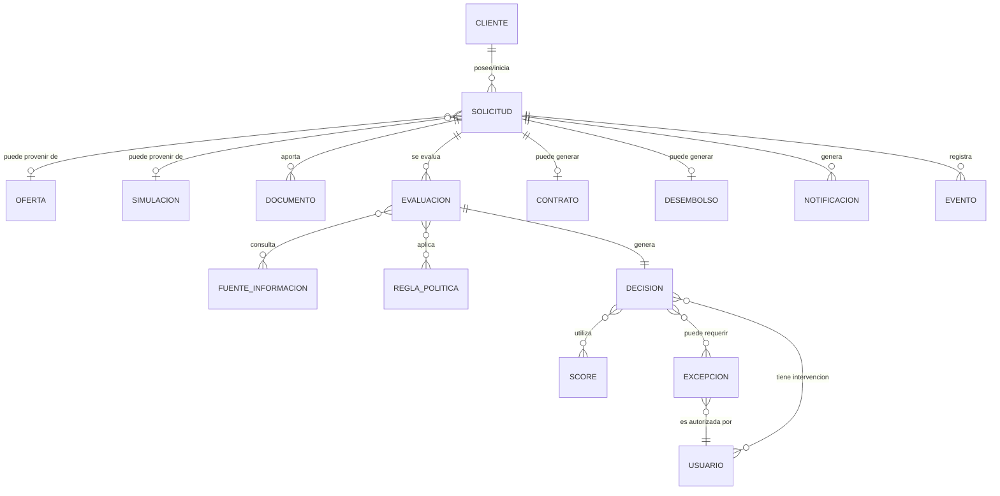

# Crédito Ágil 360 — Modelo Lógico

## Criterio

El modelo lógico se mantiene al nivel de entidades y relaciones porque las entrevistas no proporcionan atributos completos, claves ni catálogos. No se inventan columnas.

## Entidades lógicas propuestas a partir de objetos explícitos

| Entidad | Propósito derivado | Atributos mínimos explícitos |
|---|---|---|
| CLIENTE | Representar al solicitante/cliente existente | Identidad, edad, residencia, situación laboral, ingresos, obligaciones, comportamiento, exposición |
| SOLICITUD | Representar el trámite | Identificador único, canal de origen, estado |
| OFERTA | Representar oferta recibida | No definido |
| SIMULACION | Representar simulación | No definido |
| DOCUMENTO | Representar documento aportado | Documento de origen, legibilidad; otros no definidos |
| EVALUACION | Representar proceso de evaluación | Datos utilizados, fuentes, hora, score, versión de reglas |
| DECISION | Representar resultado | Resultado, razones internas, condiciones de aprobación, vigencia |
| EXCEPCION | Representar excepción | Justificación, documentos considerados, autorizador |
| CONTRATO | Representar contrato disponible/aceptado | No definido |
| DESEMBOLSO | Representar desembolso | No definido |
| NOTIFICACION | Representar comunicación | Canal permitido; contenido sensible prohibido |
| EVENTO | Representar evento de recorrido | Tipo de evento y tiempo de respuesta cuando corresponda |
| FUENTE_INFORMACION | Identificar origen de datos | No definido |
| REGLA_POLITICA | Representar regla/política aplicada | Versión y vigencia mencionadas |
| SCORE | Representar score utilizado | Valor no especificado |
| USUARIO | Representar actor interno interviniente | Usuario que intervino/autorizó |

## Relaciones lógicas

## Discrepancias que bloquean el detalle lógico

1. No están definidos identificadores y claves.
2. No están definidos atributos completos por entidad.
3. No están definidos catálogos de estados.
4. No está definida la relación exacta entre cliente, solicitud y oferta.
5. No están definidas las fuentes externas.
6. No están definidos los criterios de deduplicación.
7. No está definida la retención de documentos/datos.
