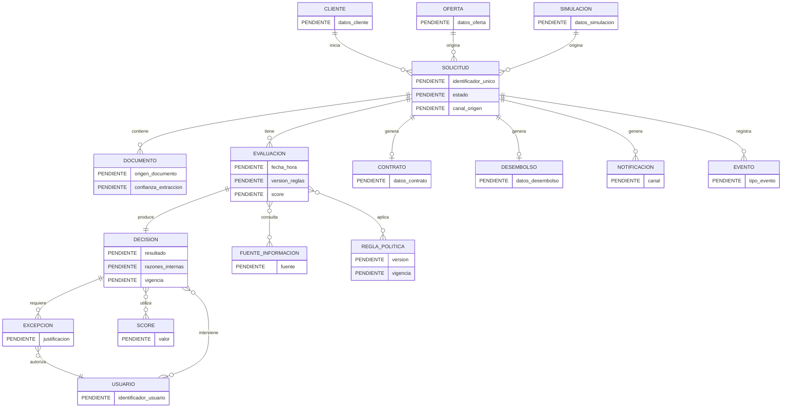

# Crédito Ágil 360 — Modelo Físico

## Estado

**NO APROBADO / BLOQUEADO POR INFORMACIÓN DE ENTREVISTAS.**

Las entrevistas permiten identificar objetos de negocio, pero no proporcionan información suficiente para definir un modelo físico sin inventar decisiones técnicas o de datos.

## Información que sí está soportada

Los objetos mencionados son: cliente, solicitud, oferta, simulación, documento, evaluación, decisión, excepción, contrato, desembolso, notificación, evento, fuente de información, reglas/políticas, score y usuarios intervinientes.

## Información que NO está definida

- Motor de base de datos.
- Esquemas físicos.
- Tablas definitivas.
- Columnas completas.
- Tipos de datos.
- Longitudes y precisiones.
- Claves primarias.
- Claves foráneas.
- Índices.
- Particionamiento.
- Estrategia de versionado físico.
- Cifrado específico.
- Política de retención.
- Archivado.
- Volúmenes de datos.
- Estrategia de alta disponibilidad de base de datos.

Definir cualquiera de estos elementos sería inventar información no proporcionada.

## Diagrama ER físico provisional

El siguiente diagrama **no representa un DDL aprobado**. Solo muestra los objetos candidatos identificados en las entrevistas.

## Criterio de cierre

Este documento debe convertirse en modelo físico aprobado únicamente después de resolver las discrepancias listadas en `11_discrepancias.md`.
