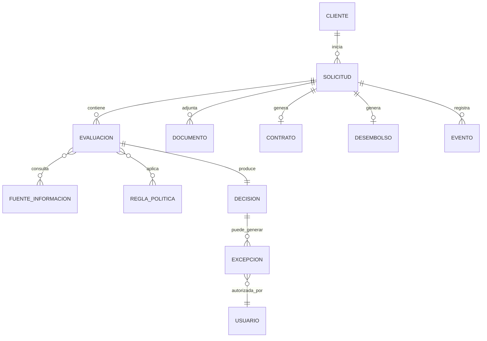
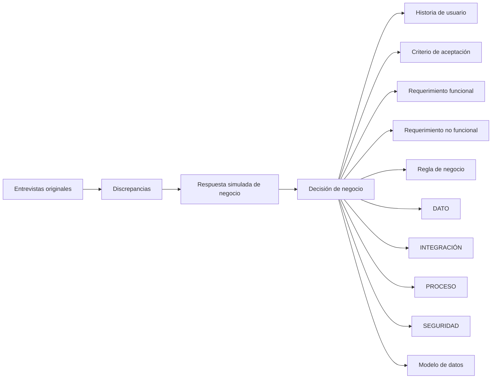

# Crédito Ágil 360 — Cierre de Brechas de Negocio

## 1. Propósito

Este documento cierra las discrepancias identificadas durante la primera especificación de **Crédito Ágil 360**.

Las entrevistas originales son ficticias y, por indicación del equipo, se simulan respuestas adicionales de negocio para cerrar las brechas. Las respuestas simuladas se presentan explícitamente como **decisiones de negocio asumidas para el cierre del descubrimiento**, por lo que deben considerarse parte de esta iteración de especificación.

El objetivo es transformar los vacíos identificados en decisiones suficientemente concretas para actualizar:

- historias de usuario;
- criterios de aceptación;
- requerimientos funcionales;
- requerimientos no funcionales;
- reglas de negocio;
- datos;
- integraciones;
- procesos;
- seguridad;
- modelo conceptual/lógico/físico;
- trazabilidad.

---

# 2. Criterio de clasificación

Cada brecha se clasifica según el artefacto SDD que debe absorber la decisión:

| Clasificación | Uso |
|---|---|
| HU | Requiere una historia de usuario nueva o modificación de una existente. |
| CA | Requiere precisar comportamiento verificable de una historia. |
| RF | Requiere una funcionalidad del sistema. |
| RNF | Requiere un atributo de calidad o restricción técnica/operativa. |
| RN | Requiere una regla de negocio explícita. |
| DATO | Requiere definición de información, fuente o propiedad de datos. |
| INTEGRACIÓN | Requiere definición de interacción con otro sistema. |
| PROCESO | Requiere precisar una etapa, transición o flujo. |
| SEGURIDAD | Requiere controles de acceso/protección. |
| DATOS/BD | Requiere decisión de persistencia/modelo físico. |
| MÉTRICA | Requiere fórmula o definición de indicador. |
| ALCANCE | Requiere decisión de inclusión/exclusión del MVP. |

---

# 3. Cierre de brechas

## CB-001 — Fuentes externas exactas

**Discrepancia original:** D-001.

### Pregunta simulada a Riesgos

¿Qué fuentes externas deben consultarse para la evaluación del MVP?

### Respuesta simulada de negocio

Para el MVP se utilizará la información externa proveniente de las fuentes de información crediticia que el banco tenga contratadas y habilitadas para el producto. No se requiere integrar una fuente nueva para el lanzamiento del MVP.

La solución debe manejar la fuente como un proveedor configurable, de forma que Riesgos pueda incorporar o reemplazar una fuente posteriormente sin modificar el flujo completo de originación.

### Decisión

- No se fija un proveedor específico en esta especificación.
- Las fuentes externas serán configurables.
- La evaluación debe registrar qué fuente fue consultada.
- La respuesta de la fuente debe quedar asociada a la evaluación histórica.

### Clasificación

**RF + RNF + DATO + INTEGRACIÓN**

### Regla de negocio

**RN-001:** Toda consulta externa utilizada para una decisión debe identificar la fuente y quedar asociada a la evaluación que originó la consulta.

---

# 4. CB-002 — Política de retención

**Discrepancia original:** D-002.

### Pregunta simulada a Cumplimiento / Riesgos

¿Cuánto tiempo deben conservarse solicitudes, documentos, evaluaciones y decisiones?

### Respuesta simulada de negocio

Para el MVP se conservará la información necesaria para demostrar la trazabilidad de la originación y decisión crediticia durante el periodo exigido por las políticas internas y obligaciones regulatorias aplicables al producto.

No se establecerá en este documento un número de años porque Cumplimiento debe validar el plazo definitivo antes de producción.

### Decisión

- La información de decisión debe ser histórica e inmutable.
- La retención debe aplicarse también a la evidencia necesaria para reconstruir la decisión.
- El plazo cuantitativo queda como parámetro de Cumplimiento.

### Clasificación

**RNF + DATO**

### Regla de negocio

**RN-002:** Una decisión crediticia no puede eliminarse o modificarse mientras se encuentre dentro del periodo de retención definido por Cumplimiento.

### Estado

**Cerrada funcionalmente; plazo cuantitativo pendiente de parametrización por Cumplimiento.**

---

# 5. CB-003 — Deduplicación e idempotencia

**Discrepancia original:** D-003.

### Pregunta simulada a Riesgos

¿Cómo distinguimos una nueva solicitud de un reintento?

### Respuesta simulada de negocio

Una solicitud debe tener un identificador único desde su creación. Los reintentos provenientes de una misma interacción deben conservar ese identificador.

No se debe crear una nueva solicitud cuando el cliente repite una operación debido a timeout, error de comunicación o refresco de pantalla.

Si existe una solicitud activa del mismo cliente para el mismo producto y proceso, el sistema debe advertir que ya existe un trámite en curso antes de iniciar otro.

### Decisión

Se utilizarán dos controles:

1. **Idempotencia técnica:** evita ejecutar dos veces la misma operación.
2. **Control de solicitud activa:** evita crear solicitudes duplicadas para el mismo cliente/producto/proceso.

### Clasificación

**RF + RNF + RN**

### Reglas de negocio

**RN-003:** Cada solicitud debe poseer un identificador único.

**RN-004:** Un reintento de una operación no debe generar una segunda solicitud.

**RN-005:** No se permitirá iniciar una nueva solicitud equivalente mientras exista una solicitud activa para el mismo cliente y producto, salvo que una regla de negocio autorice expresamente el nuevo trámite.

---

# 6. CB-004 — Actualización de datos

**Discrepancia original:** D-004.

### Pregunta simulada a Canales y Riesgos

¿Qué datos puede actualizar el cliente y cuándo se consideran vigentes?

### Respuesta simulada de negocio

El cliente podrá confirmar o actualizar datos de contacto, dirección e información laboral cuando el flujo lo permita.

Los datos financieros utilizados para la evaluación no deben ser modificados libremente después de que se haya iniciado una evaluación. Si cambia información relevante durante la evaluación, el sistema debe determinar si corresponde volver a evaluar.

### Decisión

Se separan:

- datos confirmables/actualizables;
- datos utilizados como evidencia de una decisión.

### Clasificación

**RF + RN + PROCESO**

### Reglas de negocio

**RN-006:** Los datos de contacto, dirección e información laboral podrán ser confirmados o actualizados durante el proceso cuando estén habilitados para el cliente.

**RN-007:** Una modificación de información que pueda afectar una decisión crediticia debe provocar una nueva evaluación o validación según la política de Riesgos.

**RN-008:** Los datos utilizados para una decisión histórica deben conservarse como evidencia de esa decisión y no sobrescribirse.

---

# 7. CB-005 — SLA por etapa

**Discrepancia original:** D-005.

### Pregunta simulada a Negocio / Operaciones

¿Qué SLA debe cumplir cada etapa?

### Respuesta simulada de negocio

El objetivo inicial es reducir el tiempo total de evaluación, pero los SLA definitivos deben ser establecidos por Operaciones después de medir las capacidades reales de las integraciones.

Para el MVP se requiere medir el tiempo de cada etapa y generar alertas operativas cuando una etapa exceda el umbral configurado.

### Decisión

No se inventan valores de minutos u horas.

Se incorpora:

- medición por etapa;
- umbrales configurables;
- identificación de operaciones fuera de SLA.

### Clasificación

**RF + RNF + MÉTRICA**

### Regla de negocio

**RN-009:** Cada etapa relevante del proceso debe tener un umbral operativo configurable.

### Estado

**Cerrada conceptualmente; valores cuantitativos pendientes de Operaciones.**

---

# 8. CB-006 — Integraciones

**Discrepancia original:** D-006.

### Pregunta simulada a Arquitectura / Negocio

¿Qué sistemas deben integrarse en el MVP?

### Respuesta simulada de negocio

El flujo debe consultar información interna del banco, fuentes externas cuando correspondan y el sistema que permita realizar el desembolso.

La solución no debe exigir la modernización simultánea de todos los sistemas legados.

### Decisión

Las integraciones mínimas del MVP son:

1. información interna del cliente;
2. fuentes externas de evaluación;
3. desembolso/core;
4. servicios de notificación.

### Clasificación

**INTEGRACIÓN + RF + RNF**

### Regla de arquitectura derivada

**RA-001:** Las integraciones deben estar desacopladas de la lógica principal de originación para permitir la evolución progresiva de sistemas legados.

### Pendiente técnico

Protocolos, contratos API, timeouts y mecanismos de autenticación serán definidos en el diseño técnico.

---

# 9. CB-007 — Desembolso y core bancario

**Discrepancia original:** D-007.

### Pregunta simulada a Operaciones

¿Cómo debe realizarse el desembolso?

### Respuesta simulada de negocio

Crédito Ágil 360 no reemplazará el core bancario. Una vez aceptado el contrato y cumplidas las condiciones, la solución enviará la instrucción de desembolso al sistema correspondiente.

El resultado del desembolso debe quedar asociado a la solicitud.

### Decisión

- El core continúa siendo responsable del desembolso.
- Crédito Ágil 360 orquesta la solicitud.
- Debe recibirse confirmación del resultado.
- Un reintento no puede provocar doble desembolso.

### Clasificación

**RF + INTEGRACIÓN + RNF**

### Regla de negocio

**RN-010:** Una solicitud solo puede generar un desembolso exitoso.

---

# 10. CB-008 — Autenticación

**Discrepancia original:** D-008.

### Pregunta simulada a Seguridad

¿Cómo se autenticarán los actores?

### Respuesta simulada de negocio

Los clientes deben autenticarse mediante los mecanismos de identidad digital existentes del banco.

Los usuarios internos utilizarán el mecanismo corporativo de autenticación.

La solución no debe crear una identidad paralela para el MVP.

### Decisión

- Cliente: identidad digital existente.
- Usuarios internos: identidad corporativa existente.
- No se crea un repositorio paralelo de credenciales.

### Clasificación

**SEGURIDAD + RNF**

### Regla de seguridad

**RS-001:** Crédito Ágil 360 no almacenará credenciales primarias de los usuarios si estas son gestionadas por los mecanismos corporativos existentes.

### Pendiente técnico

El mecanismo concreto, protocolo y proveedor se definirán en arquitectura y seguridad.

---

# 11. CB-009 — Autorización y segregación

**Discrepancia original:** D-009.

### Pregunta simulada a Riesgos y Seguridad

¿Qué puede hacer cada actor?

### Respuesta simulada de negocio

El cliente puede gestionar su propia solicitud.

El asesor puede consultar y ayudar, pero no modificar decisiones de Riesgos.

El contact center puede consultar estado y registrar incidencias, pero no modificar decisiones.

El analista puede evaluar y recomendar excepciones.

El supervisor puede aprobar excepciones cuando corresponda.

### Matriz de autorización

| Actor | Consultar solicitud | Modificar datos | Evaluar | Recomendar excepción | Aprobar excepción | Modificar decisión |
|---|---:|---:|---:|---:|---:|---:|
| Cliente | Propia | Permitido según datos habilitados | No | No | No | No |
| Asesor | Autorizado | No | No | No | No | No |
| Contact center | Autorizado | No | No | No | No | No |
| Analista Riesgos | Sí | Según función | Sí | Sí | No cuando requiera supervisor | No fuera de su función |
| Supervisor | Sí | Según función | Sí | Sí | Sí según nivel | Según política |
| Sistema | Automático | Automático | Ejecuta reglas | No | No | No |

### Clasificación

**SEGURIDAD + RN + RF**

### Regla de negocio

**RN-011:** Ningún usuario puede aprobar una excepción cuando la política exige la aprobación de un nivel superior.

---

# 12. CB-010 — Documentos

**Discrepancia original:** D-010.

### Pregunta simulada a Operaciones

¿Qué documentos se recibirán?

### Respuesta simulada de negocio

Los documentos dependerán de la situación de la solicitud. Para clientes existentes con información suficiente, se buscará evitar solicitar documentos que el banco ya posea y que sean válidos para la evaluación.

Cuando Riesgos requiera evidencia documental, el cliente podrá adjuntarla.

### Decisión

- No se solicitarán documentos innecesarios.
- El conjunto documental será determinado por las reglas de evaluación.
- Cada documento debe estar asociado a la solicitud.
- La evidencia utilizada en la decisión debe conservarse.

### Clasificación

**RF + RN + DATO**

### Regla de negocio

**RN-012:** No se debe solicitar al cliente un documento que pueda ser utilizado desde una fuente interna vigente y autorizada, cuando Riesgos determine que dicha fuente es suficiente.

---

# 13. CB-011 — Inteligencia artificial

**Discrepancia original:** D-011.

### Pregunta simulada a CEO y Riesgos

¿Qué límites tendrá la IA?

### Respuesta simulada de negocio

La IA tendrá carácter asistivo.

Puede:

- extraer información de documentos;
- detectar inconsistencias;
- orientar al cliente;
- resumir casos para analistas.

No puede:

- aprobar créditos;
- rechazar créditos;
- alterar reglas de Riesgos;
- inventar datos faltantes.

Los resultados con confianza inferior al umbral definido por Riesgos deben ser revisados por una persona.

### Decisión

La decisión crediticia seguirá siendo determinada por políticas controladas y auditables.

### Clasificación

**HU + RF + RNF + RN**

### Reglas

**RN-013:** La IA no puede emitir por sí misma la decisión crediticia final.

**RN-014:** La IA no puede completar un dato que no esté presente en el documento analizado.

**RN-015:** Todo dato extraído por IA debe conservar documento de origen y nivel de confianza.

**RN-016:** Un resultado por debajo del umbral establecido por Riesgos requiere revisión humana.

---

# 14. CB-012 — Reglas de elegibilidad

**Discrepancia original:** D-012.

### Pregunta simulada a Riesgos

¿Cómo deben administrarse las reglas?

### Respuesta simulada de negocio

Las reglas deben poder cambiar por campaña, segmento, apetito de riesgo y regulación.

Cada versión debe tener vigencia y debe poder identificarse cuál fue utilizada en una decisión.

El cambio de una regla no debe modificar decisiones históricas.

### Decisión

Las reglas serán versionadas y tendrán vigencia.

### Clasificación

**RF + RNF + RN**

### Reglas

**RN-017:** Una evaluación debe utilizar una versión identificable de las reglas.

**RN-018:** Las reglas deben tener vigencia.

**RN-019:** Cambiar una regla no modifica decisiones históricas.

---

# 15. CB-013 — Excepciones

**Discrepancia original:** D-013.

### Pregunta simulada a Riesgos

¿Cómo se determina quién aprueba una excepción?

### Respuesta simulada de negocio

La matriz de aprobación se definirá por nivel de riesgo.

El analista puede recomendar una excepción.

Cuando el nivel de riesgo supere el límite autorizado para el analista, debe intervenir un supervisor.

### Decisión

La matriz de aprobación será parametrizable.

### Clasificación

**RN + RF + SEGURIDAD**

### Regla

**RN-020:** La autorización de una excepción dependerá del nivel de riesgo y de la autoridad asignada al usuario.

### Pendiente residual

Los valores concretos de cada nivel y autoridad deben ser proporcionados por Riesgos.

---

# 16. CB-014 — Rechazos y mensajes al cliente

**Discrepancia original:** D-014.

### Pregunta simulada a Riesgos y Canales

¿Cómo se mostrarán los motivos de rechazo?

### Respuesta simulada de negocio

Las razones internas de Riesgos no se mostrarán literalmente al cliente.

Debe existir un catálogo de razones internas asociado a mensajes externos comprensibles y aprobados por Riesgos/Canales.

### Decisión

Se separan:

- razón interna;
- mensaje externo.

### Clasificación

**RF + RN + CA**

### Regla

**RN-021:** Una razón interna de rechazo no se mostrará literalmente al cliente si contiene información que el negocio haya determinado como no comunicable.

---

# 17. CB-015 — Contrato y aceptación

**Discrepancia original:** D-015.

### Pregunta simulada a Operaciones / Legal

¿Cómo se acepta el contrato?

### Respuesta simulada de negocio

El contrato debe estar disponible para revisión del cliente antes de continuar al desembolso.

La aceptación debe dejar evidencia de que el cliente aceptó la versión presentada.

### Decisión

- Debe conservarse la versión contractual aceptada.
- Debe existir evidencia de aceptación.
- El desembolso no puede continuar sin aceptación cuando esta sea requisito.

### Clasificación

**RF + DATO + PROCESO + RN**

### Regla

**RN-022:** No se puede pasar a listo para desembolso cuando el contrato requerido no haya sido aceptado.

### Pendiente técnico

Mecanismo específico de firma/aceptación y requisitos legales.

---

# 18. CB-016 — Notificaciones

**Discrepancia original:** D-016.

### Pregunta simulada a Canales

¿Cómo deben gestionarse las notificaciones?

### Respuesta simulada de negocio

El cliente seleccionará los canales permitidos disponibles.

Las notificaciones deben ser generadas por eventos del proceso.

Si un canal falla, debe poder utilizarse otro canal permitido cuando la política de comunicación lo permita.

Nunca deben incluirse datos financieros sensibles en el contenido.

### Clasificación

**RF + RNF + PROCESO**

### Regla

**RN-023:** Una notificación solo puede utilizar canales habilitados para el cliente y permitidos por el banco.

---

# 19. CB-017 — Máquina de estados

**Discrepancia original:** D-017.

### Pregunta simulada a Canales y Riesgos

¿Cuál es la máquina de estados oficial?

### Respuesta simulada de negocio

Los estados visibles al cliente serán:

1. Borrador.
2. Información pendiente.
3. En evaluación.
4. Requiere documento.
5. Requiere validación.
6. Aprobado.
7. No aprobado.
8. Pendiente de aceptación.
9. Listo para desembolso.
10. Desembolsado.
11. Cancelado.

Los estados internos pueden ser más detallados, pero deben mapearse a estos estados visibles.

### Decisión

La máquina de estados visible queda cerrada.

### Clasificación

**PROCESO + RF + CA**

### Regla

**RN-024:** Todo estado interno visible al cliente debe mapear a uno de los estados externos aprobados.

---

# 20. CB-018 — Síncrono vs asíncrono

**Discrepancia original:** D-018.

### Pregunta simulada a Arquitectura / Negocio

¿Qué actividades deben ejecutarse de forma inmediata y cuáles pueden continuar en segundo plano?

### Respuesta simulada de negocio

La experiencia del cliente no debe quedar bloqueada esperando procesos externos que puedan tardar.

Las consultas o procesos que no puedan responder inmediatamente deben poder continuar y actualizar posteriormente el estado de la solicitud.

### Decisión

Clasificación funcional:

**Síncrono cuando:**
- el resultado sea necesario para continuar inmediatamente;
- la respuesta esté disponible dentro del tiempo operativo esperado.

**Asíncrono cuando:**
- una integración pueda tardar;
- se requiera reprocesamiento;
- el resultado pueda actualizar posteriormente el estado.

### Clasificación

**PROCESO + RNF**

### Nota

La implementación tecnológica concreta queda para arquitectura.

---

# 21. CB-019 — Datos maestros vs transaccionales

**Discrepancia original:** D-019.

### Pregunta simulada a Datos / Negocio

¿Qué información debe tratarse como maestra y qué información pertenece a la solicitud?

### Respuesta simulada de negocio

Los datos permanentes del cliente que provienen de sistemas maestros deben conservar su fuente de origen.

La solicitud debe conservar una fotografía de los datos efectivamente utilizados para la evaluación.

Por tanto, la solicitud no debe depender de que el dato maestro permanezca igual para reconstruir una decisión histórica.

### Decisión

**Datos maestros:**
- identidad;
- datos de contacto;
- información del cliente mantenida por sistemas corporativos.

**Datos transaccionales/evidencia de solicitud:**
- información utilizada en la solicitud;
- documentos;
- respuestas de fuentes;
- evaluación;
- score;
- versión de reglas;
- decisión;
- excepciones;
- aceptación;
- desembolso;
- eventos.

### Clasificación

**DATO + RNF + DATOS/BD**

### Regla

**RN-025:** La evaluación debe conservar una representación histórica de los datos efectivamente utilizados en la decisión.

---

# 22. CB-020 — Modelo físico

**Discrepancia original:** D-020.

### Pregunta simulada a Datos / Arquitectura

¿Debe Crédito Ágil 360 almacenar toda la información maestra?

### Respuesta simulada de negocio

No. La solución no debe duplicar innecesariamente datos sensibles.

Debe almacenar la información transaccional y la evidencia necesaria para operar y auditar el proceso.

Los datos maestros deben consultarse desde sus sistemas de origen cuando corresponda.

### Decisión

El modelo físico debe separar:

- referencias a información maestra;
- datos propios de la solicitud;
- evidencia de evaluación;
- documentos/evidencias;
- decisiones;
- auditoría;
- eventos.

### Clasificación

**DATOS/BD + RNF**

### Regla

**RN-026:** No se duplicará información maestra sensible cuando pueda ser consultada desde una fuente corporativa autorizada y la duplicación no sea necesaria para la trazabilidad.

---

# 23. CB-021 — Seguridad técnica

**Discrepancia original:** D-021.

### Pregunta simulada a Seguridad

¿Qué controles mínimos deben aplicarse?

### Respuesta simulada de negocio

La solución debe aplicar mínimo privilegio, segregación de funciones, protección de información sensible, trazabilidad de accesos y protección de información durante transmisión y almacenamiento.

Los detalles tecnológicos se definirán en la arquitectura de seguridad.

### Clasificación

**RNF + SEGURIDAD**

### Reglas

**RS-002:** Los usuarios solo podrán ejecutar operaciones autorizadas para su rol.

**RS-003:** Las operaciones relevantes de Riesgos deben quedar auditadas.

**RS-004:** La información sensible debe protegerse durante transmisión y almacenamiento conforme a las políticas de seguridad del banco.

---

# 24. CB-022 — Disponibilidad, RTO y RPO

**Discrepancia original:** D-022.

### Pregunta simulada a DevOps / Operaciones

¿Qué objetivos de disponibilidad se requieren?

### Respuesta simulada de negocio

La plataforma debe mantenerse operativa durante campañas y debe poder recuperarse ante fallos sin perder información ya confirmada por el cliente.

Los valores cuantitativos de disponibilidad, RTO y RPO serán definidos por Arquitectura y Operaciones antes del pase a producción.

### Clasificación

**RNF**

### Decisión

- Alta disponibilidad durante campañas.
- No pérdida de información confirmada.
- RTO/RPO quedan como parámetros de arquitectura pendientes.

---

# 25. CB-023 — Rendimiento y capacidad

**Discrepancia original:** D-023.

### Pregunta simulada a Canales / DevOps

¿Cómo dimensionamos el MVP?

### Respuesta simulada de negocio

El volumen base es:

- 8,000 simulaciones diarias.
- 1,500 solicitudes diarias.
- hasta 5 veces el tráfico durante las primeras horas de una campaña.

La solución debe soportar el pico sin degradación que impida continuar el proceso.

### Clasificación

**RNF**

### Requisito

**RNF-021:** La plataforma debe dimensionarse para soportar el volumen normal y un incremento de hasta cinco veces durante campañas.

### Pendiente

La latencia objetivo por operación debe ser definida por Arquitectura/DevOps.

---

# 26. CB-024 — Analítica

**Discrepancia original:** D-024.

### Pregunta simulada a Canales / Producto

¿Qué eventos deben medirse?

### Respuesta simulada de negocio

Como mínimo:

- ingreso;
- abandono;
- error;
- documento rechazado;
- reintento;
- tiempo de respuesta;
- conversión.

Estos eventos deben permitir identificar en qué etapa se pierde al cliente.

### Clasificación

**RF + MÉTRICA + RNF**

### Regla

**RN-027:** Cada evento analítico debe asociarse a una etapa de la solicitud y contener únicamente los datos necesarios para el análisis.

---

# 27. CB-025 — Acceso de asesor y contact center

**Discrepancia original:** D-025.

### Pregunta simulada a Canales / Seguridad

¿Qué información puede visualizar cada rol?

### Respuesta simulada de negocio

El asesor y contact center deben poder conocer el estado, las acciones pendientes y la información mínima necesaria para ayudar al cliente.

No deben acceder a información de Riesgos que no sea necesaria para su función.

No pueden modificar una decisión crediticia.

### Clasificación

**SEGURIDAD + RF + RN**

### Regla

**RS-005:** El acceso interno se limitará a la información necesaria para cumplir la función del usuario.

---

# 28. CB-026 — Cumplimiento

**Discrepancia original:** D-026.

### Pregunta simulada a Cumplimiento

¿Qué debe observar el producto antes de producción?

### Respuesta simulada de negocio

Cumplimiento debe validar:

- tratamiento de datos personales;
- conservación de evidencia;
- comunicaciones al cliente;
- trazabilidad de decisiones;
- condiciones contractuales;
- uso de IA;
- obligaciones regulatorias aplicables al producto.

### Decisión

Cumplimiento se incorpora como control obligatorio previo a producción.

### Clasificación

**RNF + PROCESO + SEGURIDAD**

### Criterio

**CA-026.1:** La solución no podrá pasar a producción sin validación de Cumplimiento sobre los controles regulatorios aplicables.

---

# 29. CB-027 — Alcance formal del MVP

**Discrepancia original:** D-027.

### Pregunta simulada a Producto

¿Qué queda dentro y fuera del MVP?

### Respuesta simulada de negocio

### Incluido

- crédito personal;
- clientes existentes;
- clientes con ingresos recurrentes;
- campaña de clientes con abono de sueldo;
- canales app, web, agencia y contact center;
- evaluación;
- revisión manual;
- excepciones;
- aceptación contractual;
- desembolso;
- seguimiento de estado.

### Fuera del MVP

- clientes nuevos;
- trabajadores independientes;
- otros productos crediticios.

### Clasificación

**ALCANCE**

### Regla

**RN-028:** Una solicitud fuera del segmento/producto definido para MVP no podrá incorporarse al flujo sin una decisión posterior de alcance.

---

# 30. CB-028 — Métricas de éxito

**Discrepancia original:** D-028.

### Pregunta simulada a CEO / Producto

¿Cómo se medirán los indicadores de éxito?

### Respuesta simulada de negocio

Se utilizarán los cuatro indicadores identificados por CEO:

1. conversión de ofertas a desembolsos;
2. tiempo medio desde solicitud hasta decisión;
3. abandono por etapa;
4. mora temprana.

Además, se medirá la proporción de solicitudes que requieren intervención manual.

### Clasificación

**MÉTRICA + RF**

### Definiciones iniciales

**Conversión:**

`desembolsos originados / ofertas elegibles`

**Tiempo medio a decisión:**

`promedio(fecha_hora_decisión - fecha_hora_inicio_solicitud)`

**Abandono por etapa:**

`solicitudes abandonadas en etapa / solicitudes que ingresaron a etapa`

**Intervención manual:**

`solicitudes con intervención manual / solicitudes evaluadas`

### Pendiente

La definición exacta de mora temprana y ventana temporal debe ser validada por Riesgos.

---

# 31. Reglas de negocio consolidadas

A partir del cierre de brechas se obtiene el siguiente catálogo:

| ID | Regla |
|---|---|
| RN-001 | Toda consulta externa utilizada para decisión identifica su fuente. |
| RN-002 | Una decisión no puede eliminarse/modificarse durante su periodo de retención. |
| RN-003 | Cada solicitud posee identificador único. |
| RN-004 | Un reintento no crea una segunda solicitud. |
| RN-005 | No se permite solicitud equivalente activa duplicada. |
| RN-006 | El cliente puede confirmar/actualizar datos habilitados. |
| RN-007 | Cambios relevantes pueden provocar nueva evaluación. |
| RN-008 | La evidencia histórica no se sobrescribe. |
| RN-009 | Cada etapa relevante posee umbral operativo configurable. |
| RN-010 | Una solicitud solo puede generar un desembolso exitoso. |
| RN-011 | Las excepciones respetan la autoridad según nivel de riesgo. |
| RN-012 | No se solicita documento si existe evidencia interna vigente y suficiente. |
| RN-013 | IA no emite decisión crediticia final. |
| RN-014 | IA no inventa datos faltantes. |
| RN-015 | Los datos extraídos por IA conservan origen y confianza. |
| RN-016 | Confianza inferior al umbral requiere revisión humana. |
| RN-017 | Cada evaluación identifica versión de reglas. |
| RN-018 | Las reglas poseen vigencia. |
| RN-019 | Cambiar reglas no modifica decisiones históricas. |
| RN-020 | La autorización de excepción depende de nivel de riesgo y autoridad. |
| RN-021 | Las razones internas no se muestran literalmente si no son comunicables. |
| RN-022 | No hay desembolso sin aceptación contractual cuando esta sea requisito. |
| RN-023 | Notificaciones usan canales habilitados. |
| RN-024 | Estados internos se mapean a estados visibles aprobados. |
| RN-025 | La evaluación conserva los datos efectivamente utilizados. |
| RN-026 | No se duplican datos maestros sensibles innecesariamente. |
| RN-027 | Los eventos analíticos contienen solo información necesaria. |
| RN-028 | El alcance del MVP se limita al producto y segmento definidos. |

---

# 32. Nuevas historias de usuario derivadas del cierre

El cierre de brechas permite identificar historias que en la primera iteración estaban implícitas o incompletas.

| ID | Historia |
|---|---|
| HU-023 | Como sistema, quiero identificar la fuente de cada consulta externa para reconstruir una decisión histórica. |
| HU-024 | Como cliente, quiero que un reintento no cree una nueva solicitud cuando la operación anterior no terminó correctamente. |
| HU-025 | Como Riesgos, quiero controlar solicitudes activas equivalentes para evitar duplicidad de evaluación. |
| HU-026 | Como Riesgos, quiero versionar las reglas de elegibilidad para saber qué política produjo una decisión. |
| HU-027 | Como Riesgos, quiero configurar niveles de autoridad para excepciones según el riesgo. |
| HU-028 | Como Riesgos, quiero mantener la evidencia histórica de los datos utilizados en una decisión. |
| HU-029 | Como Seguridad, quiero controlar el acceso por rol para impedir que asesor/contact center modifiquen decisiones de Riesgos. |
| HU-030 | Como Producto, quiero medir el abandono y desempeño por etapa para mejorar la conversión. |
| HU-031 | Como Cumplimiento, quiero validar los controles regulatorios antes de producción. |

---

# 33. Nuevos criterios de aceptación derivados

## CA-023 — Fuente de consulta

Dado que una evaluación consulta una fuente externa, cuando la respuesta sea registrada, entonces debe quedar identificada la fuente utilizada.

## CA-024 — Reintento

Dado que una operación no terminó por timeout, cuando el cliente reintenta, entonces el sistema debe recuperar la operación existente y no crear otra solicitud equivalente.

## CA-025 — Solicitud activa

Dado que existe una solicitud activa equivalente, cuando el cliente intenta iniciar otra, entonces el sistema debe identificar la solicitud existente y evitar duplicarla.

## CA-026 — Versionado de reglas

Dado que se ejecuta una evaluación, entonces debe registrarse la versión de reglas utilizada y su vigencia.

## CA-027 — Excepción

Dado que una excepción supera la autoridad del analista, cuando se solicite su aprobación, entonces debe intervenir el supervisor correspondiente.

## CA-028 — Evidencia histórica

Dado que una decisión fue emitida, cuando cambien posteriormente los datos del cliente, entonces la evidencia utilizada en la decisión original debe permanecer disponible.

## CA-029 — Segregación

Dado que un usuario de contact center consulta una solicitud, entonces puede consultar el estado y registrar incidencia, pero no modificar la decisión crediticia.

## CA-030 — IA

Dado que un documento no contiene un dato, cuando la IA lo procese, entonces el campo no debe ser completado mediante inferencia como si hubiera sido encontrado en el documento.

---

# 34. Impacto sobre los modelos de datos

El cierre de brechas permite pasar de un modelo conceptual abierto a un modelo lógico más preciso.

## Entidades que deben conservar evidencia histórica

- SOLICITUD
- EVALUACION
- DECISION
- REGLA_POLITICA
- FUENTE_INFORMACION
- DOCUMENTO
- EXCEPCION
- CONTRATO
- DESEMBOLSO
- EVENTO

## Relaciones importantes

## Decisión de diseño de datos

La solicitud debe conservar una representación de los datos utilizados en la evaluación para evitar que la modificación del maestro del cliente altere la capacidad de reconstrucción de una decisión histórica.

---

# 35. Actualización del modelo físico: decisiones ahora cerradas

Con el cierre de brechas ya es posible exigir conceptualmente:

- identificador único de solicitud;
- identificación de versión de reglas;
- identificación de fuente consultada;
- registro de fecha/hora de evaluación;
- resultado de evaluación;
- razones internas;
- evidencia de excepción;
- usuario autorizador;
- evidencia contractual;
- resultado de desembolso;
- eventos de proceso;
- información de auditoría;
- referencia a documentos;
- confianza y origen de extracción IA cuando aplique.

Sin embargo, **todavía no se inventan tipos de datos, índices, nombres físicos definitivos ni motor de base de datos**, porque esas decisiones corresponden al diseño técnico y no fueron definidas por negocio.

---

# 36. Trazabilidad del cierre de brechas

---

# 37. Estado de las brechas

| ID | Estado |
|---|---|
| D-001 | Cerrada funcionalmente |
| D-002 | Cerrada con parámetro pendiente |
| D-003 | Cerrada |
| D-004 | Cerrada |
| D-005 | Cerrada con valores pendientes |
| D-006 | Cerrada a nivel de alcance |
| D-007 | Cerrada funcionalmente |
| D-008 | Cerrada a nivel de negocio |
| D-009 | Cerrada |
| D-010 | Cerrada funcionalmente |
| D-011 | Cerrada |
| D-012 | Cerrada conceptualmente; reglas concretas pendientes |
| D-013 | Cerrada conceptualmente; matriz cuantitativa pendiente |
| D-014 | Cerrada |
| D-015 | Cerrada funcionalmente; mecanismo legal/técnico pendiente |
| D-016 | Cerrada funcionalmente |
| D-017 | Cerrada |
| D-018 | Cerrada conceptualmente; diseño técnico pendiente |
| D-019 | Cerrada |
| D-020 | Cerrada a nivel conceptual; detalle físico pendiente |
| D-021 | Cerrada como objetivo; controles técnicos pendientes |
| D-022 | Cerrada como objetivo; RTO/RPO y disponibilidad cuantitativa pendientes |
| D-023 | Cerrada en capacidad de negocio; latencias pendientes |
| D-024 | Cerrada |
| D-025 | Cerrada |
| D-026 | Cerrada como proceso; obligaciones concretas pendientes |
| D-027 | Cerrada |
| D-028 | Cerrada parcialmente; definición de mora temprana pendiente |

---

# 38. Brechas residuales después del cierre

El cierre simulado elimina las brechas de negocio principales, pero quedan **decisiones de detalle que deben pasar a las siguientes disciplinas**.

## Riesgos

- Reglas concretas de elegibilidad.
- Parámetros de score.
- Límites de exposición.
- Niveles cuantitativos de excepción.
- Umbral de confianza de IA.
- Definición de mora temprana.

## Cumplimiento / Legal

- Plazo de retención.
- Obligaciones regulatorias concretas.
- Requisitos de aceptación/firma.
- Mensajes de rechazo permitidos.

## Arquitectura

- Contratos de integración.
- Protocolos.
- Síncrono/asíncrono por interfaz.
- Gestión de errores.
- Diseño físico.
- Disponibilidad.
- RTO/RPO.
- Latencias.

## Seguridad

- Mecanismo concreto de autenticación.
- Autorización técnica.
- Gestión de secretos.
- Cifrado.
- Auditoría técnica.

## DevOps

- Dimensionamiento.
- Escalamiento.
- monitoreo.
- alertamiento.
- despliegue.
- recuperación.

Estas cuestiones ya no son necesariamente **brechas de negocio**; deben convertirse en decisiones de diseño, arquitectura, seguridad, operaciones o cumplimiento.

---

# 39. Conclusión

El ejercicio de cierre permite transformar las discrepancias iniciales en decisiones de negocio simuladas y clasificarlas correctamente.

El principio aplicado es:

> **No toda discrepancia debe convertirse en un requerimiento funcional.**

Algunas brechas se convierten en:

- historias de usuario;
- criterios de aceptación;
- reglas de negocio;
- requerimientos funcionales;
- requerimientos no funcionales;
- restricciones de seguridad;
- definiciones de datos;
- integraciones;
- decisiones de proceso;
- decisiones de alcance;
- métricas.

Esto permite que la siguiente versión de la especificación SDD sea más precisa y evita introducir decisiones técnicas como si fueran requerimientos de negocio.

## Estado final

**Cierre de brechas de negocio: APROBABLE PARA LA SIGUIENTE ITERACIÓN DE SDD, bajo el supuesto explícito de que las respuestas incluidas en este documento son simuladas y deben ser consideradas decisiones ficticias de negocio para continuar el ejercicio.**

Las decisiones cuantitativas que quedaron pendientes deben transformarse en tareas de cierre específicas para Riesgos, Cumplimiento, Arquitectura, Seguridad, Datos y DevOps.
