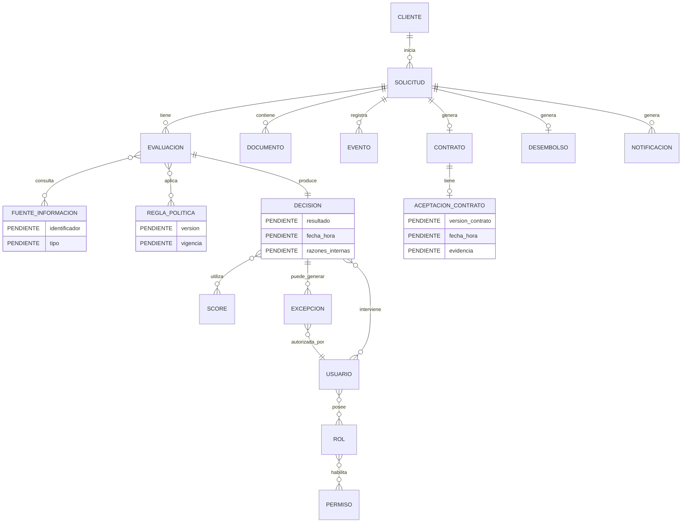

# Crédito Ágil 360 — Reclasificación de Brechas y Actualización SDD

## 1. Objetivo

Este documento toma como entrada:

- las entrevistas originales;
- `12_cierre_de_brechas.md`;
- la primera especificación SDD.

El objetivo es **reclasificar cada brecha cerrada en el artefacto SDD que realmente corresponde**, evitando que todas las brechas se conviertan artificialmente en requerimientos funcionales.

Una misma brecha puede producir más de un artefacto. Por ejemplo:

> Una decisión de negocio puede generar una regla de negocio, una historia de usuario y criterios de aceptación.

---

# 2. Resultado general de la reclasificación

| Tipo de artefacto | Resultado |
|---|---:|
| Historias de usuario existentes | 22 |
| Nuevas historias derivadas del cierre | 9 |
| Historias de usuario consolidadas | 31 |
| Criterios de aceptación nuevos | 8 principales + ampliaciones |
| Requerimientos funcionales existentes | 35 |
| Nuevos RF derivados del cierre | 12 |
| Requerimientos funcionales consolidados | 47 |
| Requerimientos no funcionales existentes | 20 |
| Nuevos RNF derivados del cierre | 5 |
| RNF consolidados | 25 |
| Reglas de negocio nuevas | 28 |
| Casos de uso afectados | 8 |
| Nuevos casos de uso | 0 |
| Decisiones de datos | 6 |
| Decisiones de integración | 5 |
| Decisiones de seguridad | 5 |
| Decisiones de proceso | 6 |
| Discrepancias residuales | 15 |

> Las cantidades anteriores representan la reclasificación documental. No significan que cada elemento sea una funcionalidad independiente de la aplicación.

---

# 3. Matriz de reclasificación de las 28 brechas

| Brecha | Clasificación principal | Artefactos derivados |
|---|---|---|
| D-001 Fuentes externas | INTEGRACIÓN / DATO | RF, RN, HU |
| D-002 Retención | RNF / DATO | RNF, RN |
| D-003 Deduplicación | RF / RNF / RN | HU, CA, RF, RNF, RN |
| D-004 Actualización de datos | RF / RN / PROCESO | HU, CA, RF, RN |
| D-005 SLA | RNF / MÉTRICA | RF, RNF, RN |
| D-006 Integraciones | INTEGRACIÓN | RF, RNF, CU |
| D-007 Desembolso | INTEGRACIÓN / PROCESO | RF, RN, CA |
| D-008 Autenticación | SEGURIDAD | RNF, seguridad |
| D-009 Autorización | SEGURIDAD / RN | HU, RF, RNF, RN |
| D-010 Documentos | RF / DATO | RF, RN, CA |
| D-011 IA | HU / RF / RNF / RN | HU, CA, RF, RNF, RN |
| D-012 Reglas | RN / RF | RF, RNF, RN |
| D-013 Excepciones | RN / SEGURIDAD | HU, RF, RN, CA |
| D-014 Rechazos | RF / RN / CA | RF, RN, CA |
| D-015 Contrato | RF / PROCESO / DATO | RF, RN, CA |
| D-016 Notificaciones | RF / RNF / PROCESO | RF, RN, CA |
| D-017 Estados | PROCESO | RF, RN, CA |
| D-018 Síncrono/asíncrono | ARQUITECTURA / PROCESO | RNF, CU |
| D-019 Datos maestros/transaccionales | DATO / DATOS-BD | RN, modelo lógico/físico |
| D-020 Modelo físico | DATOS/BD | modelo lógico/físico |
| D-021 Seguridad técnica | RNF / SEGURIDAD | RNF, reglas seguridad |
| D-022 Disponibilidad | RNF | RNF |
| D-023 Rendimiento | RNF | RNF |
| D-024 Analítica | RF / MÉTRICA | RF, RNF, RN |
| D-025 Acceso interno | SEGURIDAD / RF | HU, RF, RNF, RN |
| D-026 Cumplimiento | PROCESO / RNF | RNF, CA, proceso |
| D-027 MVP | ALCANCE | alcance, RN |
| D-028 Métricas | MÉTRICA | RF, métricas |

---

# 4. Historias de usuario

## 4.1 Historias existentes que se mantienen

Se mantienen las HU-001 a HU-022 de la primera versión cuando su contenido ya representa correctamente una necesidad de usuario.

No se deben duplicar historias solo porque una brecha haya producido una regla o un criterio de aceptación.

---

# 5. Nuevas historias de usuario

## HU-023 — Identificación de fuente externa

**Como** analista de Riesgos  
**quiero** identificar la fuente externa utilizada en una evaluación  
**para** poder reconstruir la información que participó en la decisión.

**Origen:** D-001.

---

## HU-024 — Reintento sin duplicación

**Como** cliente  
**quiero** que un reintento de una operación fallida continúe mi solicitud existente  
**para** evitar que se genere una solicitud duplicada.

**Origen:** D-003.

---

## HU-025 — Control de solicitud activa

**Como** sistema  
**quiero** detectar solicitudes activas equivalentes  
**para** evitar duplicidad de solicitudes y evaluaciones.

**Origen:** D-003.

---

## HU-026 — Versionado de reglas

**Como** analista de Riesgos  
**quiero** conocer la versión de reglas aplicada a una evaluación  
**para** reconstruir por qué se produjo una decisión.

**Origen:** D-012.

---

## HU-027 — Gestión de autoridad de excepciones

**Como** supervisor de Riesgos  
**quiero** aprobar excepciones cuando el nivel de riesgo supere la autoridad del analista  
**para** mantener la segregación de funciones.

**Origen:** D-013.

---

## HU-028 — Evidencia histórica

**Como** área de Riesgos  
**quiero** conservar los datos utilizados en una decisión  
**para** poder reconstruir la decisión aunque posteriormente cambien los datos maestros.

**Origen:** D-019/D-020.

---

## HU-029 — Control de acceso interno

**Como** responsable de Seguridad  
**quiero** controlar las operaciones disponibles para cada rol  
**para** impedir accesos o modificaciones no autorizadas.

**Origen:** D-009/D-025.

---

## HU-030 — Analítica por etapa

**Como** área de Producto  
**quiero** medir los eventos de cada etapa del proceso  
**para** identificar abandono, errores, reintentos y oportunidades de mejora.

**Origen:** D-024/D-028.

---

## HU-031 — Validación de cumplimiento

**Como** responsable de Cumplimiento  
**quiero** validar los controles regulatorios aplicables antes de producción  
**para** asegurar que el proceso pueda operar conforme a las obligaciones aplicables.

**Origen:** D-026.

---

# 6. Criterios de aceptación nuevos

## CA-023 — Fuente externa

**Dado** que una evaluación utiliza una fuente externa,  
**cuando** se registre la respuesta,  
**entonces** debe quedar identificada la fuente utilizada.

---

## CA-024 — Reintento

**Dado** que una operación no terminó correctamente,  
**cuando** el cliente reintente la operación,  
**entonces** debe utilizarse la solicitud existente y no crear una nueva solicitud equivalente.

---

## CA-025 — Solicitud activa

**Dado** que existe una solicitud activa equivalente,  
**cuando** el cliente intente iniciar otra,  
**entonces** el sistema debe identificar la solicitud existente y evitar la duplicación.

---

## CA-026 — Versionado de reglas

**Dado** que se ejecuta una evaluación,  
**cuando** se emite una decisión,  
**entonces** debe registrarse la versión de reglas utilizada y su vigencia.

---

## CA-027 — Excepción

**Dado** que una excepción supera la autoridad del analista,  
**cuando** se solicite su aprobación,  
**entonces** debe intervenir el supervisor autorizado.

---

## CA-028 — Evidencia histórica

**Dado** que una decisión ya fue emitida,  
**cuando** posteriormente cambie información del cliente,  
**entonces** la evidencia utilizada para la decisión original debe permanecer disponible.

---

## CA-029 — Segregación

**Dado** que un usuario de contact center consulta una solicitud,  
**cuando** visualice el trámite,  
**entonces** podrá consultar el estado y registrar una incidencia, pero no modificar la decisión crediticia.

---

## CA-030 — IA

**Dado** que un documento no contiene un determinado dato,  
**cuando** la IA procese el documento,  
**entonces** no debe registrar el dato como si hubiera sido encontrado.

---

# 7. Requerimientos funcionales derivados

## RF-036 — Identificación de fuente

La solución debe registrar la fuente de información utilizada por cada consulta que participe en una evaluación.

**Origen:** D-001.

---

## RF-037 — Control de solicitudes activas

La solución debe identificar solicitudes activas equivalentes antes de crear una nueva solicitud.

**Origen:** D-003.

---

## RF-038 — Reanudación idempotente

La solución debe permitir reintentar operaciones sin crear solicitudes, evaluaciones o desembolsos duplicados.

**Origen:** D-003.

---

## RF-039 — Gestión de datos actualizables

La solución debe permitir confirmar o actualizar los datos habilitados para el cliente durante el proceso.

**Origen:** D-004.

---

## RF-040 — Umbral operativo por etapa

La solución debe permitir registrar y controlar el cumplimiento del umbral operativo configurado para cada etapa relevante.

**Origen:** D-005.

---

## RF-041 — Evidencia de aceptación contractual

La solución debe conservar la versión contractual que el cliente aceptó y la evidencia de aceptación.

**Origen:** D-015.

---

## RF-042 — Gestión de autorización por rol

La solución debe controlar las operaciones disponibles según el rol del usuario.

**Origen:** D-009/D-025.

---

## RF-043 — Catálogo de mensajes de rechazo

La solución debe asociar las razones internas de rechazo con mensajes externos aprobados para el cliente.

**Origen:** D-014.

---

## RF-044 — Gestión de estados internos/externos

La solución debe mantener los estados internos del proceso y mapearlos a los estados visibles aprobados para el cliente.

**Origen:** D-017.

---

## RF-045 — Eventos analíticos

La solución debe registrar eventos de ingreso, abandono, error, documento rechazado, reintento, tiempo de respuesta y conversión.

**Origen:** D-024.

---

## RF-046 — Control de confianza de IA

Cuando se utilice IA documental, la solución debe conservar el nivel de confianza de los datos extraídos y derivar a revisión humana los resultados que estén por debajo del umbral configurado.

**Origen:** D-011.

---

## RF-047 — Validación previa de Cumplimiento

La solución debe permitir gestionar la evidencia de validación de Cumplimiento requerida antes del paso a producción.

**Origen:** D-026.

---

# 8. Requerimientos no funcionales derivados

## RNF-021 — Capacidad en campaña

La plataforma debe soportar el volumen normal y un incremento de hasta cinco veces durante las primeras horas de una campaña.

**Origen:** D-023.

---

## RNF-022 — Protección de información histórica

La evidencia utilizada en una decisión debe permanecer protegida contra modificación no autorizada.

**Origen:** D-002/D-019/D-021.

---

## RNF-023 — Control de acceso

El acceso debe aplicar mínimo privilegio y segregación de funciones.

**Origen:** D-009/D-021/D-025.

---

## RNF-024 — Continuidad ante fallos

Los fallos de integraciones no deben provocar pérdida de información previamente confirmada.

**Origen:** D-006/D-007/D-018.

---

## RNF-025 — Trazabilidad de integración

Las operaciones relevantes de integración deben poder ser trazadas para soportar reprocesamiento y reconstrucción de decisiones.

**Origen:** D-001/D-006/D-018.

---

# 9. Reglas de negocio

Las brechas D-002, D-003, D-004, D-005, D-007, D-009, D-010, D-011, D-012, D-013, D-014, D-015, D-016, D-017, D-019 y D-027 generan principalmente **reglas de negocio**, no nuevas funcionalidades.

## RN-001

Toda consulta externa utilizada para una decisión debe identificar la fuente.

## RN-002

Una decisión no puede modificarse durante el periodo de retención aplicable.

## RN-003

Cada solicitud debe tener un identificador único.

## RN-004

Un reintento de operación no debe crear una segunda solicitud.

## RN-005

No se permite una solicitud activa equivalente duplicada salvo que una regla explícita lo permita.

## RN-006

El cliente puede confirmar o actualizar los datos habilitados.

## RN-007

Una modificación relevante para Riesgos puede provocar una nueva evaluación.

## RN-008

Los datos utilizados en una decisión histórica no pueden ser sobrescritos.

## RN-009

Cada etapa relevante debe tener un umbral operativo configurable.

## RN-010

Una solicitud solo puede generar un desembolso exitoso.

## RN-011

La autorización de una excepción depende del nivel de riesgo y de la autoridad del usuario.

## RN-012

No se solicitará al cliente documentación que pueda ser obtenida de una fuente interna vigente y suficiente.

## RN-013

La IA no puede emitir la decisión crediticia final.

## RN-014

La IA no puede inventar información inexistente en el documento.

## RN-015

Los datos extraídos por IA deben mantener documento de origen y nivel de confianza.

## RN-016

Los resultados de IA por debajo del umbral de confianza deben revisarse manualmente.

## RN-017

Toda evaluación debe identificar la versión de reglas utilizada.

## RN-018

Las reglas deben tener vigencia.

## RN-019

Una modificación de reglas no debe alterar decisiones históricas.

## RN-020

Las excepciones deben respetar la matriz de autoridad.

## RN-021

Las razones internas de rechazo no deben exponerse literalmente cuando no sean comunicables.

## RN-022

No se puede pasar a desembolso sin aceptación contractual cuando esta sea requerida.

## RN-023

Las notificaciones solo pueden utilizar canales permitidos.

## RN-024

Todo estado interno mostrado al cliente debe mapear a un estado externo aprobado.

## RN-025

La evaluación debe conservar la información utilizada para la decisión.

## RN-026

No se duplicará información maestra sensible innecesariamente.

## RN-027

Los eventos analíticos deben contener únicamente información necesaria para el análisis.

## RN-028

El MVP se limita a créditos personales para clientes existentes con ingresos recurrentes.

---

# 10. Reglas de seguridad

Las reglas de seguridad deben mantenerse separadas de las reglas de negocio.

## RS-001

No se almacenarán credenciales primarias si son administradas por los mecanismos corporativos existentes.

## RS-002

Los usuarios solo podrán ejecutar operaciones autorizadas por su rol.

## RS-003

Las operaciones relevantes de Riesgos deben quedar auditadas.

## RS-004

La información sensible debe protegerse durante transmisión y almacenamiento.

## RS-005

Los usuarios internos solo podrán visualizar la información necesaria para su función.

---

# 11. Reclasificación por tipo de brecha

## D-001 — Fuentes externas

**Antes:** discrepancia.

**Ahora:**
- HU-023.
- RF-036.
- RN-001.
- RNF-025.
- Caso de uso CU-002.
- Modelo lógico: FUENTE_INFORMACION.

**Resultado:** cerrada como brecha de negocio; queda diseño técnico de integración.

---

## D-002 — Retención

**Antes:** discrepancia.

**Ahora:**
- RN-002.
- RNF-022.
- Modelo de datos histórico.

**No genera nueva HU.**

**Motivo:** el negocio no necesita una funcionalidad visible para ejecutar esta regla.

---

## D-003 — Deduplicación

**Antes:** discrepancia.

**Ahora:**
- HU-024.
- HU-025.
- CA-024.
- CA-025.
- RF-037.
- RF-038.
- RN-003.
- RN-004.
- RN-005.
- RNF-024.

**Resultado:** brecha transversal funcional + técnica + negocio.

---

## D-004 — Actualización de datos

**Ahora:**
- HU-003 existente.
- RF-039.
- RN-006.
- RN-007.
- RN-008.
- ampliación de CA-003.

**No se crea una HU adicional**, porque HU-003 ya cubría la necesidad.

---

## D-005 — SLA

**Ahora:**
- RF-040.
- RN-009.
- RNF-018 existente.
- Métrica de tiempo de respuesta.

**No se crea HU.**

---

## D-006 — Integraciones

**Ahora:**
- RF existentes de consulta.
- RF-036.
- RNF-024.
- RNF-025.
- CU-002/CU-008.

**No se crea una HU nueva.**

**Motivo:** es una capacidad transversal de solución.

---

## D-007 — Desembolso

**Ahora:**
- RF-027 existente.
- RF-020 existente.
- RF-041.
- RN-010.
- CU-006.
- CA de idempotencia.

---

## D-008 — Autenticación

**Ahora:**
- RNF de seguridad.
- RS-001.
- CU-001/CU-005.

**No se crea HU.**

**Motivo:** el actor utiliza el mecanismo de identidad existente; no se introduce una nueva necesidad de negocio.

---

## D-009 — Autorización

**Ahora:**
- HU-027.
- HU-029.
- RF-042.
- RN-011.
- RS-002/RS-003/RS-005.
- CA-027/CA-029.

---

## D-010 — Documentos

**Ahora:**
- HU-005 existente.
- RF-007 existente.
- RN-012.
- CA-005 ampliado.
- modelo DOCUMENTO.

**No se crea HU.**

---

## D-011 — IA

**Ahora:**
- HU-020 existente.
- RF-046.
- RN-013 a RN-016.
- RNF-013/RNF-014 existentes.
- CA-030.
- CU-004.

**Resultado:** la brecha se distribuye entre funcionalidad, reglas y RNF.

---

## D-012 — Reglas de elegibilidad

**Ahora:**
- HU-026.
- RF-011 existente.
- RN-017/RN-018/RN-019.
- RNF-012 existente.
- CU-002.

---

## D-013 — Excepciones

**Ahora:**
- HU-014/HU-015 existentes.
- HU-027.
- RF-016 existente.
- RN-020.
- CA-027.
- RS-002.

---

## D-014 — Rechazos

**Ahora:**
- RF-043.
- RN-021.
- ampliación CA de HU-006.
- CU-005.

---

## D-015 — Contrato

**Ahora:**
- HU-008 existente.
- RF-041.
- RN-022.
- CA-008 ampliado.
- modelo CONTRATO.

---

## D-016 — Notificaciones

**Ahora:**
- HU-007/HU-009 existentes.
- RF-023/RF-024/RF-025 existentes.
- RN-023.
- CU-007.

**No se crea HU.**

---

## D-017 — Estados

**Ahora:**
- HU-006 existente.
- RF-044.
- RN-024.
- CA-006 ampliado.
- CU-005.
- proceso de estados.

---

## D-018 — Síncrono/asíncrono

**Ahora:**
- RNF-024.
- RNF-025.
- CU-008.
- decisión arquitectónica.

**No se crea HU ni RF específico.**

---

## D-019 — Datos maestros/transaccionales

**Ahora:**
- HU-028.
- RN-025.
- RN-026.
- modelo lógico.
- modelo físico.
- RNF-022.

---

## D-020 — Modelo físico

**Ahora:**
- HU-028.
- RN-025/RN-026.
- modelo lógico actualizado.
- modelo físico actualizado.

**No se convierte directamente en RF.**

---

## D-021 — Seguridad técnica

**Ahora:**
- RNF-023.
- RS-001 a RS-005.
- HU-029.

---

## D-022 — Disponibilidad

**Ahora:**
- RNF-006 existente.
- RNF de continuidad.
- arquitectura/DevOps.

**No se crea RF.**

---

## D-023 — Rendimiento

**Ahora:**
- RNF-021.
- capacidad de infraestructura.

**No se crea RF.**

---

## D-024 — Analítica

**Ahora:**
- HU-030.
- RF-045.
- RNF-018 existente.
- RN-027.
- métricas.

---

## D-025 — Acceso interno

**Ahora:**
- HU-029.
- RF-042.
- RNF-023.
- RS-005.
- CA-029.

---

## D-026 — Cumplimiento

**Ahora:**
- HU-031.
- RF-047.
- CA-026.1.
- RNF de cumplimiento/proceso.

---

## D-027 — MVP

**Ahora:**
- alcance del producto.
- RN-028.
- exclusiones explícitas.

**No genera HU ni RF.**

---

## D-028 — Métricas

**Ahora:**
- HU-030.
- RF-045.
- catálogo de métricas.
- definición de conversión.
- definición de abandono.
- definición de tiempo a decisión.
- definición de intervención manual.

**Mora temprana:** permanece pendiente de definición de Riesgos.

---

# 12. Casos de uso afectados

No es necesario crear un caso de uso por cada brecha.

Los casos existentes se enriquecen:

| CU | Cambios |
|---|---|
| CU-001 | Deduplicación, actualización de datos, autenticación |
| CU-002 | Fuente, versionado de reglas, evidencia histórica |
| CU-003 | Autoridad de excepciones y segregación |
| CU-004 | Umbral y trazabilidad de IA |
| CU-005 | Roles, estados, razones de rechazo |
| CU-006 | Evidencia contractual e idempotencia de desembolso |
| CU-007 | Canales permitidos y seguridad de notificación |
| CU-008 | Idempotencia, reprocesamiento y trazabilidad |

No se crea un CU independiente para SLA, MVP, retención, seguridad, datos maestros o rendimiento porque son restricciones transversales.

---

# 13. Modelo lógico actualizado

El cierre de brechas agrega explícitamente entidades de soporte de auditoría y configuración.

---

# 14. Modelo físico: nuevo estado

El modelo físico ya puede derivar entidades obligatorias de negocio, pero todavía no debe inventar tipos SQL.

Entidades mínimas:

- CLIENTE / referencia al maestro.
- SOLICITUD.
- EVALUACION.
- FUENTE_INFORMACION.
- REGLA_POLITICA.
- DECISION.
- SCORE.
- EXCEPCION.
- USUARIO.
- ROL.
- PERMISO.
- DOCUMENTO.
- CONTRATO.
- ACEPTACION_CONTRATO.
- DESEMBOLSO.
- NOTIFICACION.
- EVENTO.

### Restricciones físicas que ya tienen origen

- identificador único de solicitud;
- preservación histórica de decisión;
- versionado de reglas;
- trazabilidad de fuente;
- evidencia de aceptación;
- relación de autorización;
- registro de eventos;
- control de duplicidad.

### Aún no definir

- motor de BD;
- tipos de datos;
- índices concretos;
- particionamiento;
- estrategia de archivado;
- nombres físicos definitivos.

---

# 15. Matriz de trazabilidad actualizada

```mermaid
flowchart TD
    D001[D-001 Fuentes] --> HU023
    D001 --> RF036
    D001 --> RN001

    D003[D-003 Duplicidad] --> HU024
    D003 --> HU025
    D003 --> RF037
    D003 --> RF038
    D003 --> RN003
    D003 --> RN004
    D003 --> RN005

    D009[D-009 Autorización] --> HU027
    D009 --> HU029
    D009 --> RF042
    D009 --> RS002

    D011[D-011 IA] --> HU020
    D011 --> RF046
    D011 --> RN013
    D011 --> RN014
    D011 --> RN015
    D011 --> RN016

    D012[D-012 Reglas] --> HU026
    D012 --> RF011
    D012 --> RN017
    D012 --> RN018
    D012 --> RN019

    D015[D-015 Contrato] --> HU008
    D015 --> RF041
    D015 --> RN022

    D019[D-019 Datos] --> HU028
    D019 --> RN025
    D019 --> RN026

    D024[D-024 Analítica] --> HU030
    D024 --> RF045
    D024 --> RN027

    D026[D-026 Cumplimiento] --> HU031
    D026 --> RF047
    D026 --> CA026
```

---

# 16. Brechas que NO deben convertirse en historias de usuario

Esta clasificación es importante para evitar inflar artificialmente el backlog.

| Brecha | Motivo |
|---|---|
| D-002 Retención | Es una regla/restricción de datos. |
| D-005 SLA | Es atributo operacional y métrica. |
| D-006 Integraciones | Es capacidad transversal. |
| D-008 Autenticación | Es control de seguridad. |
| D-010 Documentos | Ya está cubierta por HU-005. |
| D-016 Notificaciones | Ya está cubierta por HU-007/HU-009. |
| D-018 Síncrono/asíncrono | Es decisión arquitectónica. |
| D-020 Modelo físico | Es diseño de datos. |
| D-021 Seguridad técnica | Es RNF/control de seguridad. |
| D-022 Disponibilidad | Es RNF. |
| D-023 Rendimiento | Es RNF. |
| D-027 MVP | Es decisión de alcance. |

---

# 17. Brechas que tampoco deben convertirse directamente en RF

| Brecha | Artefacto correcto |
|---|---|
| D-002 | RNF + RN |
| D-005 | RNF + métrica |
| D-008 | RNF + seguridad |
| D-018 | Arquitectura + RNF |
| D-019 | Modelo de datos + RN |
| D-020 | Modelo físico |
| D-021 | RNF + seguridad |
| D-022 | RNF |
| D-023 | RNF |
| D-027 | Alcance |
| D-028 | Métricas + RF analítico |

---

# 18. Reglas que deben permanecer fuera de los RF

Las siguientes reglas no deben convertirse en RF independientes:

- RN-002 Retención.
- RN-004 Reintento.
- RN-005 Solicitud activa equivalente.
- RN-007 Nueva evaluación ante cambio relevante.
- RN-008 Evidencia histórica.
- RN-009 Umbral operativo.
- RN-010 Un solo desembolso.
- RN-011 Autoridad de excepción.
- RN-013 IA no decide.
- RN-014 IA no inventa.
- RN-017 versión de reglas.
- RN-018 vigencia de reglas.
- RN-019 decisiones históricas.
- RN-020 autoridad por riesgo.
- RN-021 razón interna vs mensaje externo.
- RN-022 aceptación contractual.
- RN-023 canales de notificación.
- RN-024 mapeo de estados.
- RN-025 evidencia de evaluación.
- RN-026 no duplicación innecesaria de maestros.
- RN-027 minimización de datos analíticos.
- RN-028 alcance MVP.

Estas reglas deben utilizarse para complementar los RF y CA correspondientes.

---

# 19. Resultado final de la reclasificación

La primera especificación tenía una tendencia a expresar las discrepancias como vacíos genéricos.

Después del cierre:

### Historias de usuario

Se agregan únicamente las necesidades que representan un comportamiento o capacidad que un actor necesita:

- HU-023 fuente externa.
- HU-024 reintento.
- HU-025 deduplicación.
- HU-026 versionado de reglas.
- HU-027 aprobación de excepciones.
- HU-028 evidencia histórica.
- HU-029 control de acceso.
- HU-030 analítica.
- HU-031 cumplimiento.

### Criterios de aceptación

Se utilizan para precisar comportamientos verificables:

- deduplicación;
- fuente externa;
- versionado;
- excepción;
- evidencia histórica;
- segregación;
- IA.

### Requerimientos funcionales

Se agregan solamente cuando existe una capacidad que el sistema debe ejecutar:

- control de solicitudes activas;
- identificación de fuente;
- reanudación idempotente;
- actualización de datos;
- control de umbral;
- evidencia contractual;
- autorización por rol;
- catálogo de mensajes;
- estados internos/externos;
- eventos analíticos;
- confianza IA;
- validación de Cumplimiento.

### Reglas de negocio

Absorben la mayor parte de las decisiones de negocio cerradas.

### RNF

Absorben:

- capacidad;
- seguridad;
- continuidad;
- trazabilidad;
- protección histórica.

### Datos

Absorben:

- maestros vs transaccionales;
- evidencia histórica;
- fuente;
- versionado;
- contrato;
- aceptación;
- auditoría.

### Arquitectura

Absorbe:

- síncrono/asíncrono;
- desacoplamiento;
- integración;
- resiliencia.

### Alcance

Absorbe:

- definición del MVP.

---

# 20. Autovalidación

## Regla aplicada

Cada elemento nuevo debe poder responder:

> ¿De qué brecha cerrada proviene?

La respuesta está indicada mediante el campo **Origen** o mediante la sección específica de reclasificación.

## Resultado

**No se detectan historias de usuario nuevas sin origen.**

**No se detectan RF nuevos sin origen.**

**No se detectan RNF nuevos sin origen.**

**No se detectan reglas de negocio nuevas sin origen.**

Los elementos de arquitectura y modelo físico se mantienen como decisiones derivadas del cierre y no como hechos originales de las entrevistas.

## Conclusión

La reclasificación correcta no consiste en agregar todas las discrepancias como RF.

El resultado adecuado es:

**Discrepancia → decisión de negocio → clasificación SDD → artefacto correspondiente → trazabilidad.**

Esto deja una especificación más limpia, evita duplicidades y permite que el backlog de desarrollo represente solamente trabajo funcional real.
